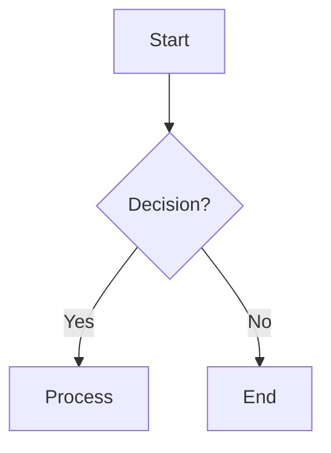
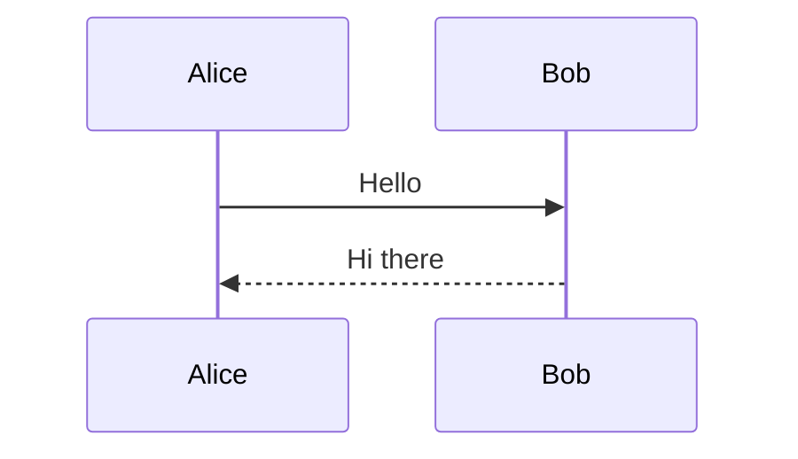
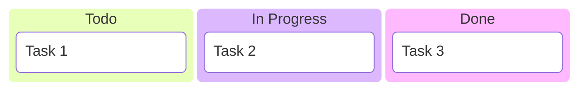
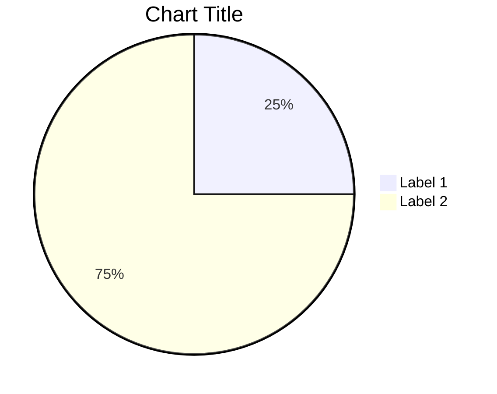
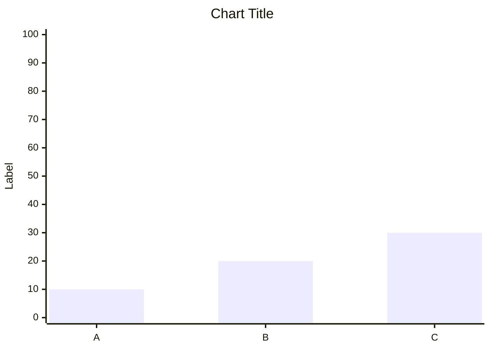
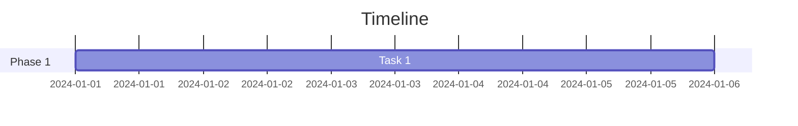
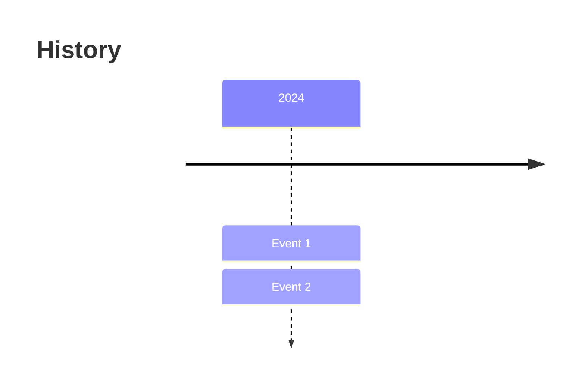
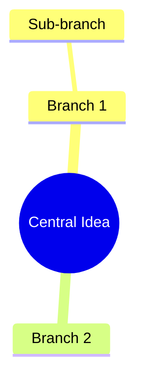
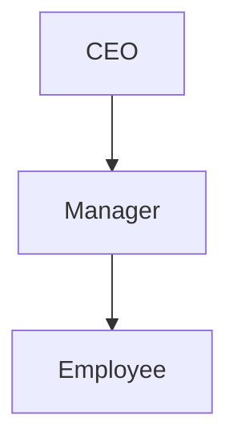

# Mermaid to Draw.io Converter - Cheat Sheet

## Quick Commands

### Installation
```bash
npm install -g @mermaid-js/mermaid-cli
npm install
```

### Basic Conversion
```bash
# Flowcharts, sequences, mindmaps, etc.
node converter.js -i input.mmd -o output.drawio

# Kanban boards
node kanban-converter.js -i board.mmd -o board.drawio

# Charts
node piechart-converter.js -i chart.mmd -o chart.drawio
node barchart-converter.js -i chart.mmd -o chart.drawio

# Project management
node gantt-converter.js -i timeline.mmd -o timeline.drawio
node timeline-converter.js -i events.mmd -o events.drawio

# Organization
node orgchart-converter.js -i org.mmd -o org.drawio

# Strategy
node swot-converter.js -i analysis.txt -o analysis.drawio
```

## Syntax Quick Reference

### Flowcharts


### Sequence Diagrams


### Kanban Boards


### Pie Charts


### Bar Charts


### Gantt Charts


### Timelines


### Mindmaps


### Org Charts


### SWOT Analysis (Text File)
```
Strengths:
- Point 1
- Point 2

Weaknesses:
- Point 1

Opportunities:
- Point 1

Threats:
- Point 1
```

## Common Options

### Input/Output
- `-i, --input`: Input file path
- `-o, --output`: Output file path

### Troubleshooting Flags
- `--verbose`: Detailed output
- `--help`: Show help information

## File Extensions

| Diagram Type | Input Extension | Output Extension |
|-------------|----------------|------------------|
| Most diagrams | `.mmd` | `.drawio` |
| SWOT Analysis | `.txt` | `.drawio` |

## Batch Processing

### Convert All Files
```bash
# All .mmd files in current directory
for file in *.mmd; do
  node converter.js -i "$file" -o "${file%.mmd}.drawio"
done
```

### Convert by Type
```bash
# Convert all kanban boards
for file in kanban-*.mmd; do
  node kanban-converter.js -i "$file" -o "${file%.mmd}.drawio"
done
```

## Error Solutions

### Command Not Found
```bash
# Check installations
node --version
npm --version
mmdc --version

# Reinstall if needed
npm install -g @mermaid-js/mermaid-cli
```

### File Not Found
```bash
# Use absolute paths
node converter.js -i /full/path/to/input.mmd -o /full/path/to/output.drawio
```

### Memory Issues
```bash
# Increase memory for large diagrams
node --max-old-space-size=4096 converter.js -i input.mmd -o output.drawio
```

### Syntax Errors
- Validate in [mermaid.live](https://mermaid.live)
- Check for missing brackets, semicolons
- Ensure proper indentation

## Performance Tips

- Convert diagrams individually for error isolation
- Use batch scripts for multiple conversions
- Keep input files under 100KB
- Close memory-intensive applications

## Integration Examples

### With Documentation
```bash
# Convert and copy to docs
node converter.js -i diagram.mmd -o docs/diagram.drawio
# Export as PNG for web docs
# (Use Draw.io export menu)
```

### With Git Workflow
```bash
# Add source files to git
git add *.mmd
git commit -m "Add diagram sources"

# Generate outputs (not committed)
node converter.js -i diagram.mmd -o diagram.drawio
```

### With Build Scripts
```bash
#!/bin/bash
echo "Building diagrams..."
mkdir -p build/diagrams
node converter.js -i docs/*.mmd -o build/diagrams/
echo "Diagrams ready!"
```

## Keyboard Shortcuts (Draw.io)

- `Ctrl+S`: Save
- `Ctrl+Z`: Undo
- `Ctrl+Y`: Redo
- `Ctrl+A`: Select all
- `Ctrl+C/V`: Copy/paste
- `F2`: Edit text
- `Delete`: Remove selected

## Resources

- **Documentation**: `Guidelines/` folder
- **Templates**: `Templates/` folder
- **Samples**: Included `sample_*.mmd` files
- **Validator**: [mermaid.live](https://mermaid.live)
- **Draw.io**: [app.diagrams.net](https://app.diagrams.net)

---

**Quick Start**: Copy a template, customize, convert, refine in Draw.io!
