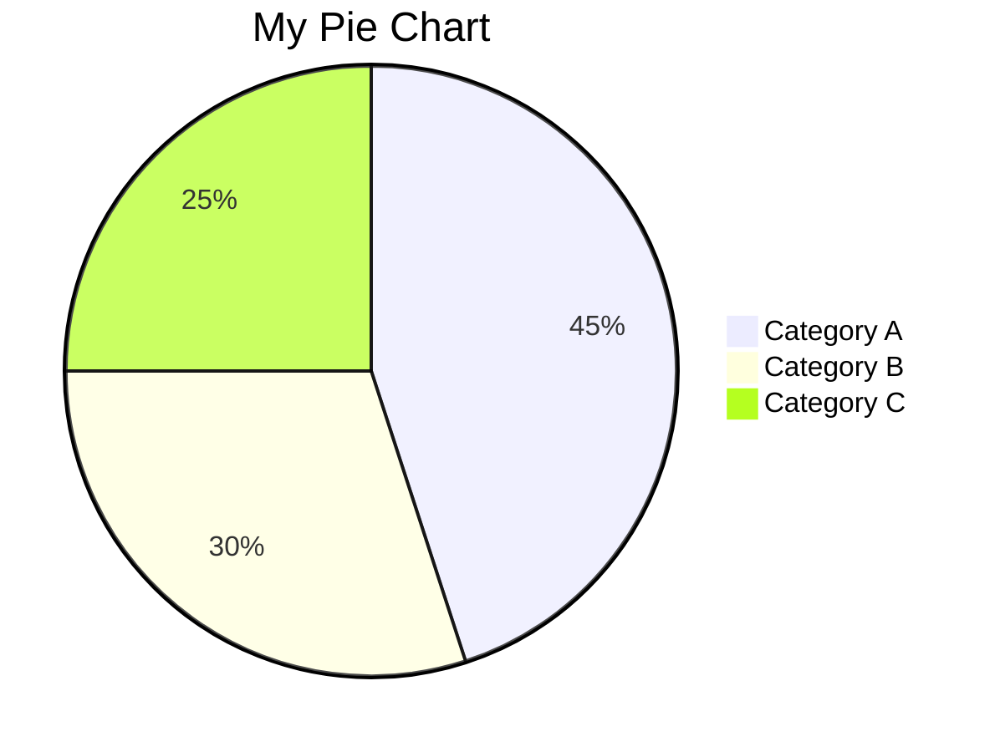
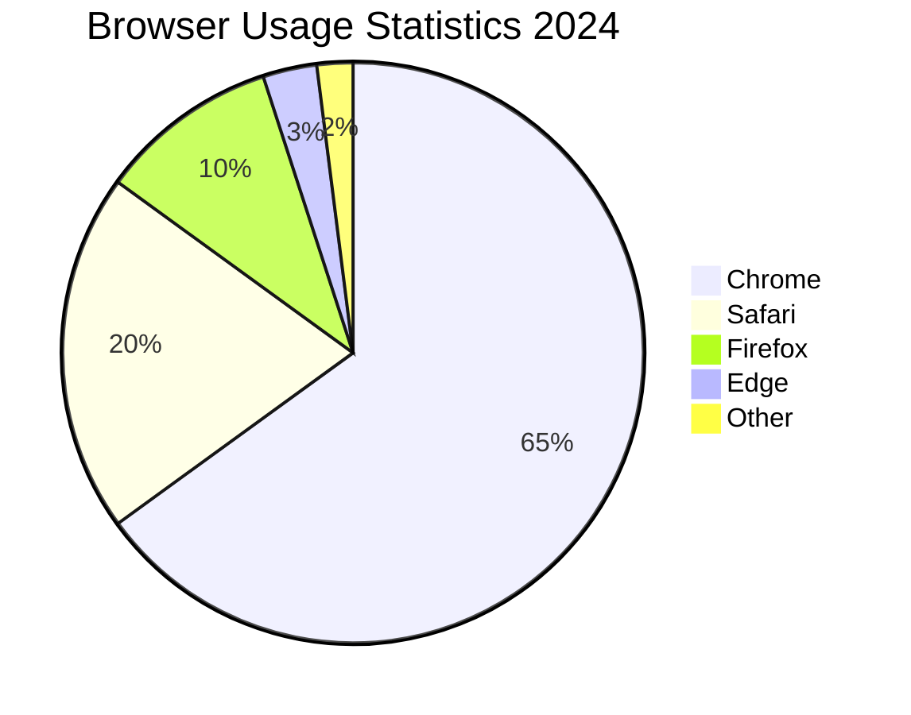
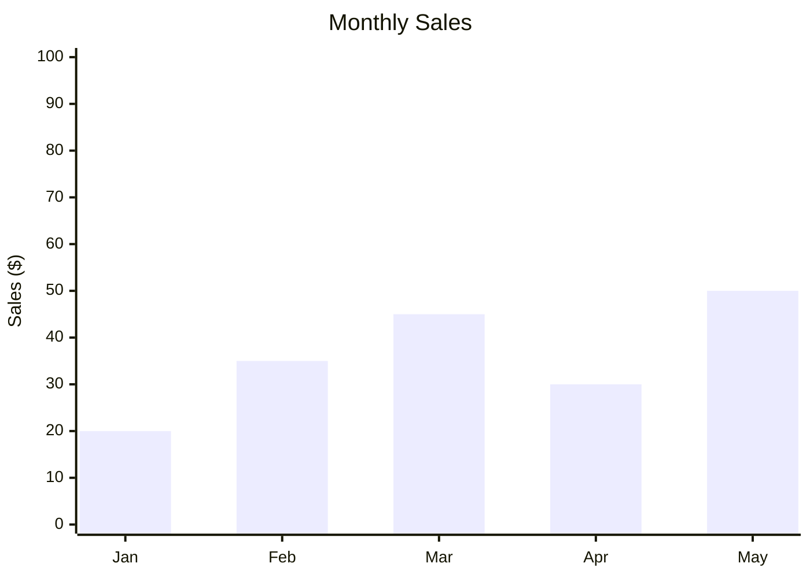
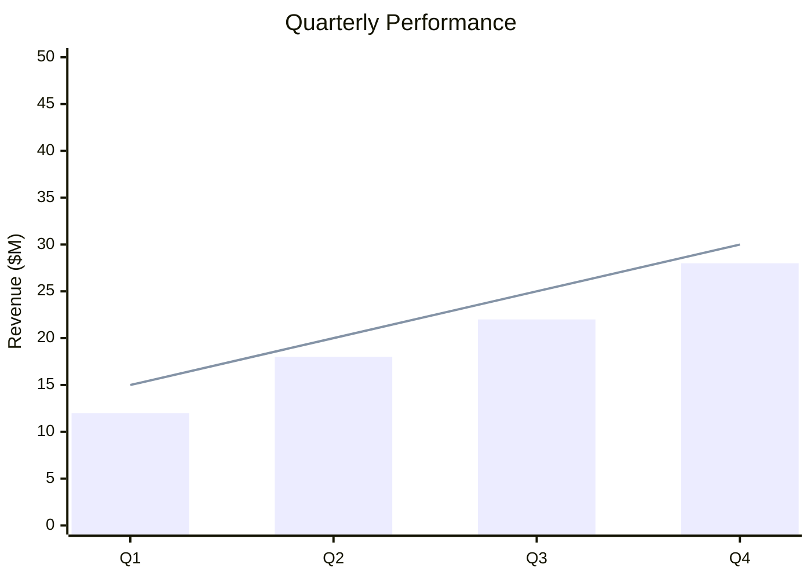
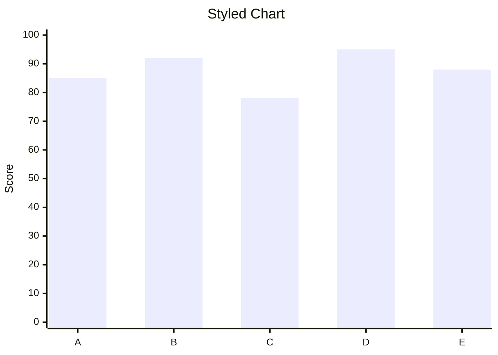

# Data Visualization Guidelines

## Overview
The toolkit supports various data visualization formats including pie charts, bar charts, and other statistical diagrams. These converters transform Mermaid chart syntax into professional Draw.io visualizations.

## Pie Chart Guidelines

### Basic Syntax


### Best Practices
- Limit to 5-8 categories for readability
- Use percentages that sum to 100%
- Include a descriptive title
- Use clear, concise category names

### Advanced Features


### Conversion Command
```bash
node piechart-converter.js -i mychart.mmd -o mychart.drawio
```

## Bar Chart Guidelines

### Basic Syntax


### Chart Types
- `bar` - Vertical bars
- `line` - Line chart
- `area` - Area chart

### Multi-Series Charts


### Configuration Options
- `title` - Chart title
- `x-axis` - Horizontal axis labels
- `y-axis` - Vertical axis configuration
- Custom colors and styling

### Conversion Command
```bash
node barchart-converter.js -i mychart.mmd -o mychart.drawio
```

## General Data Visualization Best Practices

### Data Preparation
- Clean and validate data before creating charts
- Ensure consistent data types
- Use appropriate number formatting
- Consider your audience's data literacy

### Chart Selection
- **Pie Charts**: Best for showing proportions (≤8 categories)
- **Bar Charts**: Ideal for comparisons across categories
- **Line Charts**: Perfect for trends over time
- **Area Charts**: Good for cumulative data

### Design Principles
- Use color purposefully (not just decoration)
- Include clear labels and legends
- Maintain consistent scales
- Avoid chart junk (unnecessary elements)

### Accessibility
- Ensure sufficient color contrast
- Use patterns in addition to colors
- Include data tables for screen readers
- Use descriptive titles and labels

## Advanced Chart Features

### Multiple Data Series

```mermaid
xychart-beta
    title "Multi-Series Comparison"
    x-axis [Jan, Feb, Mar, Apr, May, Jun]
    y-axis "Values" 0 --> 100
    bar "Series A" [10, 25, 35, 40, 55, 60]
    bar "Series B" [15, 30, 45, 50, 65, 70]
    line "Trend" [12, 27, 40, 45, 60, 65]
```


### Custom Styling


## Conversion Tips

### Before Converting
- Validate data ranges and categories
- Check Mermaid syntax compatibility
- Preview in Mermaid Live Editor
- Ensure data consistency

### After Converting
- Verify axis labels are readable
- Check color assignments
- Adjust chart dimensions if needed
- Add final styling in Draw.io

## Troubleshooting

### Common Issues
- **Data not displaying**: Check syntax and data format
- **Colors incorrect**: Some custom colors may not convert
- **Labels cut off**: Adjust chart size in Draw.io
- **Multiple series overlap**: Use different chart types

### Performance Notes
- Large datasets (>50 data points) may need optimization
- Complex styling can increase conversion time
- Batch convert similar charts together

## Examples
- `sample_piechart.mmd` - Browser usage statistics
- `sample_barchart.mmd` - Monthly website traffic
- `sample_gantt.mmd` - Project timeline with progress bars

## Integration Tips
- Combine with flowcharts for process + metrics
- Use consistent color schemes across diagrams
- Create dashboard layouts in Draw.io
- Export charts for reports and presentations</content>
<parameter name="filePath">/Users/disandup/Desktop/Final Converter Improved /Untitled/Guidelines/Data-Visualization-Guidelines.md
