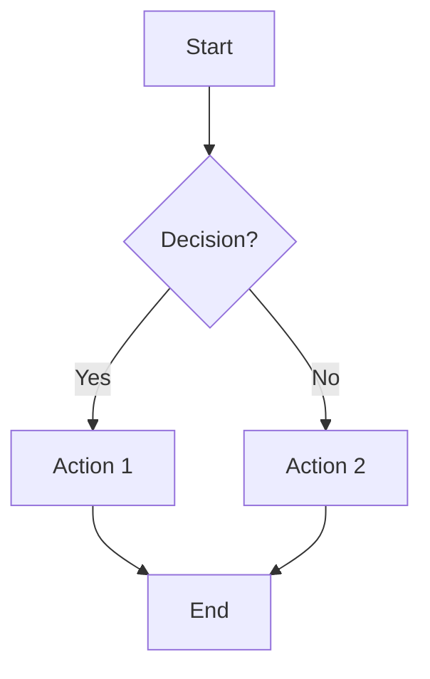
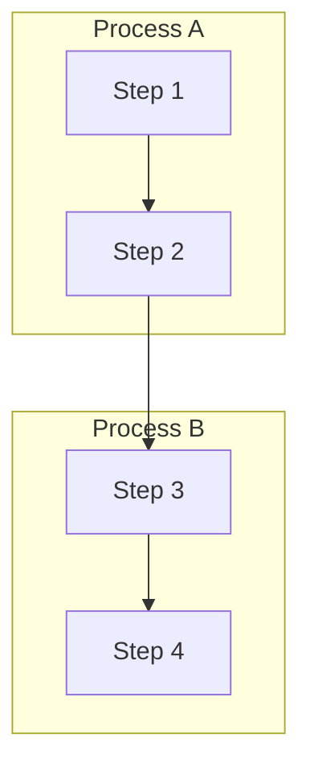
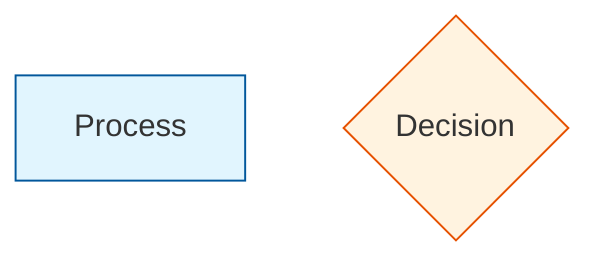
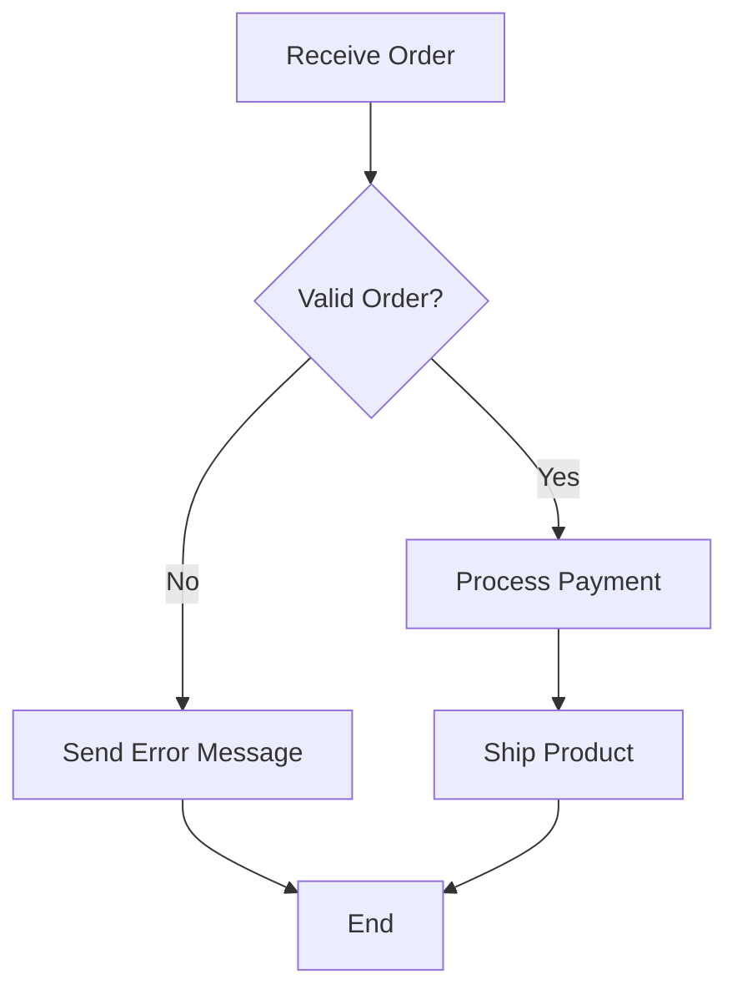
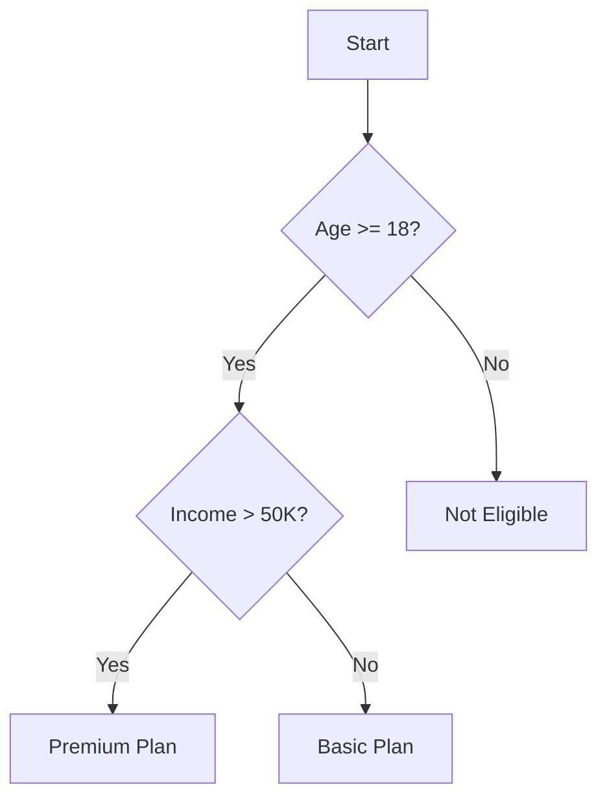
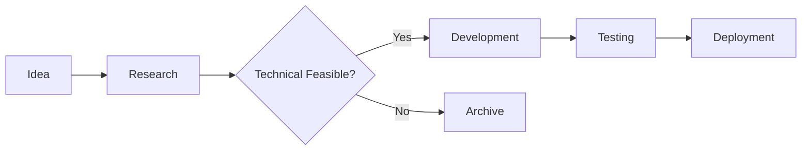

# Flowchart Guidelines

## Overview
Flowcharts are the most versatile diagram type in the toolkit, supporting process flows, decision trees, workflows, and organizational diagrams using the main `converter.js`.

## Supported Syntax

### Basic Flowchart Structure

### Direction Options
- `TD` - Top to Bottom (recommended)
- `LR` - Left to Right
- `RL` - Right to Left
- `BT` - Bottom to Top

### Node Types
- `A[Text]` - Rectangle (process)
- `B{Text}` - Diamond (decision)
- `C((Text))` - Circle (terminal)
- `D>Text]` - Right arrow (flow)
- `E{Text}` - Hexagon (preparation)

### Connection Types
- `-->` - Solid line
- `-.->` - Dotted line
- `==>` - Thick line
- `--text-->` - Labeled connection
- `-->|label|` - Conditional connection

## Best Practices

### Layout Design
- Use `TD` direction for most business processes
- Keep flow moving in one primary direction
- Limit to 10-15 nodes per diagram for readability
- Use subgraphs for complex processes

### Node Naming
- Use descriptive, action-oriented labels
- Keep text under 3-4 words per node
- Use consistent capitalization (Title Case)
- Avoid special characters in node IDs

### Decision Points
- Always provide both Yes/No or True/False paths
- Use clear, specific decision criteria
- Avoid nested decisions when possible

## Advanced Features

### Subgraphs

### Styling Classes

## Common Patterns

### Process Flow

### Decision Tree

### Workflow Diagram

## Conversion Tips

### Before Converting
- Validate syntax in Mermaid Live Editor
- Ensure all connections are properly defined
- Check for circular references

### After Converting
- Open in Draw.io to verify layout
- Adjust node sizes if text is cut off
- Fine-tune connection routing if needed

## Limitations
- Complex styling may not convert perfectly
- Some advanced Mermaid features unsupported
- Manual layout adjustments may be required

## Examples
See `sample_flowchart.mmd` for a complete working example.</content>
<parameter name="filePath">/Users/disandup/Desktop/Final Converter Improved /Untitled/Guidelines/Flowchart-Guidelines.md
