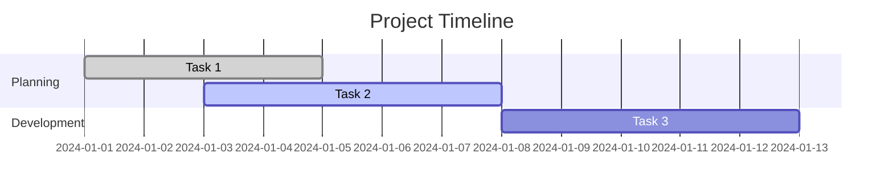
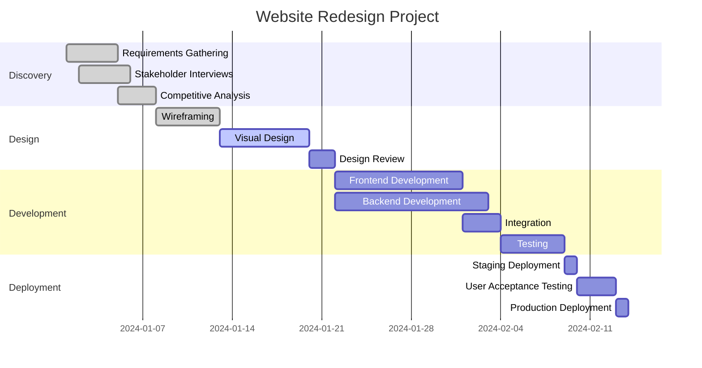
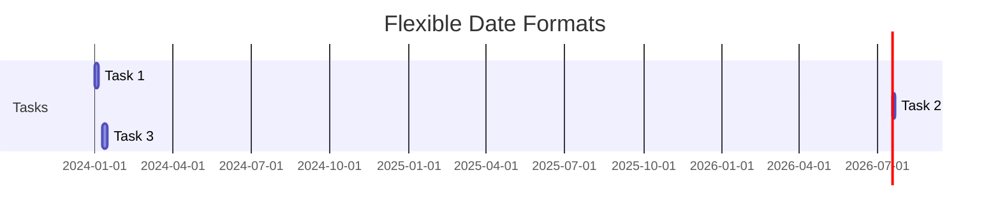
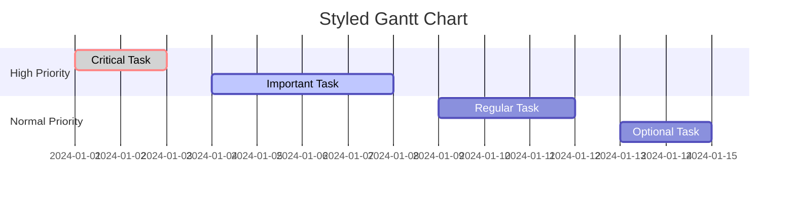
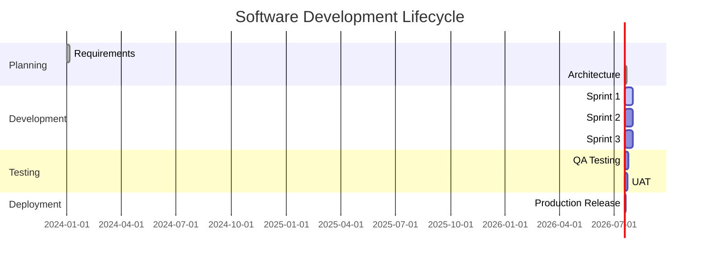
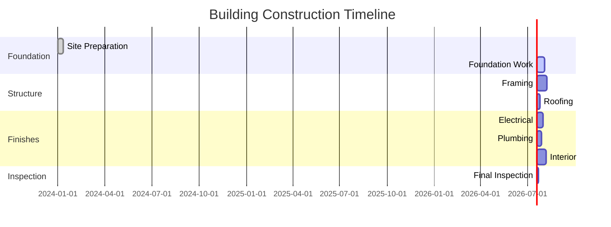

# Gantt Chart Guidelines

## Overview
Gantt charts are essential for project management, visualizing timelines, dependencies, and progress tracking. The toolkit converts Mermaid Gantt syntax into professional Draw.io project timelines.

## Basic Syntax


## Advanced Features

### Task Dependencies


### Progress Tracking
```mermaid
gantt
    title Sprint 23 Development
    dateFormat YYYY-MM-DD

    section Sprint Tasks
    User Authentication :done, auth, 2024-01-15, 2024-01-18
    Database Schema :done, db, 2024-01-15, 2024-01-20
    API Development :active, api, 2024-01-16, 2024-01-25
    Frontend Components :active, ui, 2024-01-20, 2024-01-28
    Integration Testing :pending, test, after api, 3d
    Documentation :pending, docs, after ui, 2d
```

## Best Practices

### Timeline Planning
- **Realistic durations**: Base estimates on historical data
- **Buffer time**: Include contingency for unexpected delays
- **Milestone dates**: Mark key deliverables and reviews
- **Resource allocation**: Consider team capacity and availability

### Task Organization
- **Logical grouping**: Use sections for phases or workstreams
- **Clear naming**: Descriptive task names under 50 characters
- **Priority levels**: High, Medium, Low priority indicators
- **Dependency mapping**: Identify all prerequisite tasks

### Status Tracking
- **Status types**: todo, active, done, cancelled, pending
- **Progress updates**: Regular status reviews (daily/weekly)
- **Blocker identification**: Mark and resolve impediments quickly
- **Completion criteria**: Clear definition of done for each task

## Conversion Command
```bash
node gantt-converter.js -i mygantt.mmd -o mygantt.drawio
```

## Advanced Gantt Features

### Resource Allocation
```mermaid
gantt
    title Resource Planning
    dateFormat YYYY-MM-DD

    section John Doe (Developer)
    Task A :done, john1, 2024-01-01, 2024-01-03
    Task B :active, john2, 2024-01-04, 2024-01-08
    Task C :pending, john3, after john2, 3d

    section Jane Smith (Designer)
    Design Work :done, jane1, 2024-01-01, 2024-01-05
    Review Session :active, jane2, 2024-01-06, 2024-01-07
    Final Adjustments :pending, jane3, after jane2, 2d
```

### Critical Path Analysis
```mermaid
gantt
    title Critical Path Example
    dateFormat YYYY-MM-DD

    section Critical Path
    Milestone 1 :crit, done, m1, 2024-01-01, 2024-01-01
    Critical Task A :crit, active, ca, after m1, 5d
    Critical Task B :crit, pending, cb, after ca, 3d
    Critical Task C :crit, pending, cc, after cb, 4d

    section Supporting Tasks
    Task D :active, d, after m1, 2d
    Task E :pending, e, after d, 3d
    Task F :pending, f, after e, 2d
```

## Project Management Integration

### Agile Sprints
```mermaid
gantt
    title Sprint Planning
    dateFormat YYYY-MM-DD

    section Sprint 1 (Jan 1-14)
    Story 1 :done, s1, 2024-01-01, 2024-01-03
    Story 2 :done, s2, 2024-01-04, 2024-01-08
    Story 3 :active, s3, 2024-01-09, 2024-01-12
    Sprint Review :pending, review1, 2024-01-13, 2024-01-14

    section Sprint 2 (Jan 15-28)
    Story 4 :pending, s4, 2024-01-15, 2024-01-20
    Story 5 :pending, s5, 2024-01-21, 2024-01-25
    Story 6 :pending, s6, 2024-01-26, 2024-01-28
```

### Release Planning
```mermaid
gantt
    title Product Release Timeline
    dateFormat YYYY-MM-DD

    section Q1 2024
    Feature Development :done, dev, 2024-01-01, 2024-02-15
    Quality Assurance :active, qa, 2024-02-16, 2024-03-01
    Beta Release :pending, beta, 2024-03-02, 2024-03-08
    Production Release :pending, prod, 2024-03-09, 2024-03-15

    section Post-Release
    Monitoring :pending, monitor, after prod, 30d
    Support Setup :pending, support, after prod, 7d
    Documentation :pending, docs, after prod, 14d
```

## Configuration Options

### Date Formats


### Custom Styling


## Draw.io Enhancement

### Timeline Customization
- **Time scale adjustment**: Days, weeks, months view
- **Progress bars**: Visual completion indicators
- **Dependency arrows**: Show task relationships
- **Milestone markers**: Highlight key dates

### Visual Improvements
- **Color coding**: Status-based coloring
- **Icons**: Add task type indicators
- **Grid lines**: Improve readability
- **Zoom controls**: Focus on specific time periods

## Reporting and Analytics

### Progress Metrics
- **Planned vs Actual**: Compare estimates with reality
- **Completion rates**: Track velocity and throughput
- **Delay analysis**: Identify bottleneck causes
- **Resource utilization**: Monitor team capacity

### Dashboard Integration
- **Real-time updates**: Live progress tracking
- **Stakeholder views**: Different detail levels
- **Export options**: PDF reports and presentations
- **Historical data**: Trend analysis over time

## Common Patterns

### Software Development


### Construction Project


## Troubleshooting

### Timeline Issues
- **Overlapping tasks**: Adjust dates or dependencies
- **Missing dependencies**: Add prerequisite relationships
- **Date conflicts**: Resolve scheduling conflicts
- **Scale problems**: Adjust timeline zoom levels

### Conversion Problems
- **Complex dependencies**: Simplify relationship chains
- **Long task names**: Use abbreviations
- **Date format errors**: Ensure consistent YYYY-MM-DD format
- **Status conflicts**: Verify status values are valid

## Examples
See `sample_gantt.mmd` for a complete project timeline example.</content>
<parameter name="filePath">/Users/disandup/Desktop/Final Converter Improved /Untitled/Guidelines/Gantt-Chart-Guidelines.md
