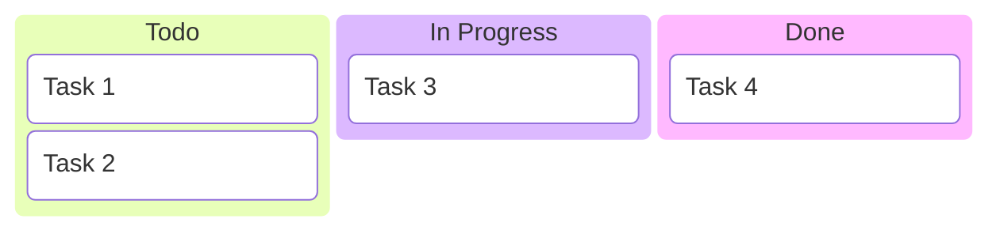
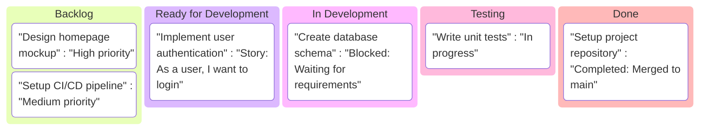
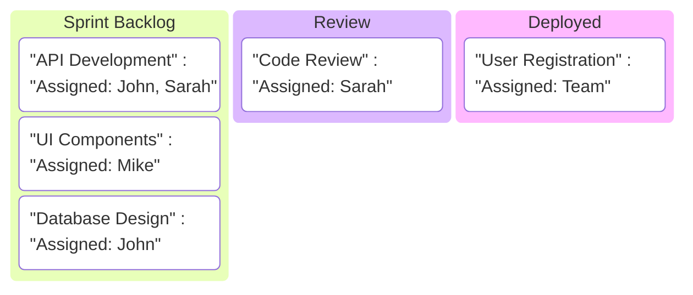
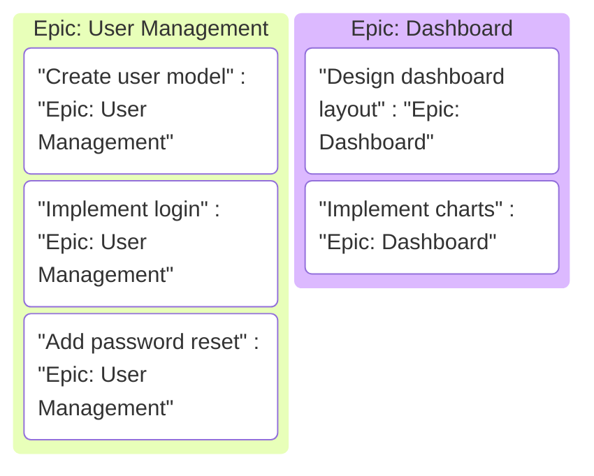
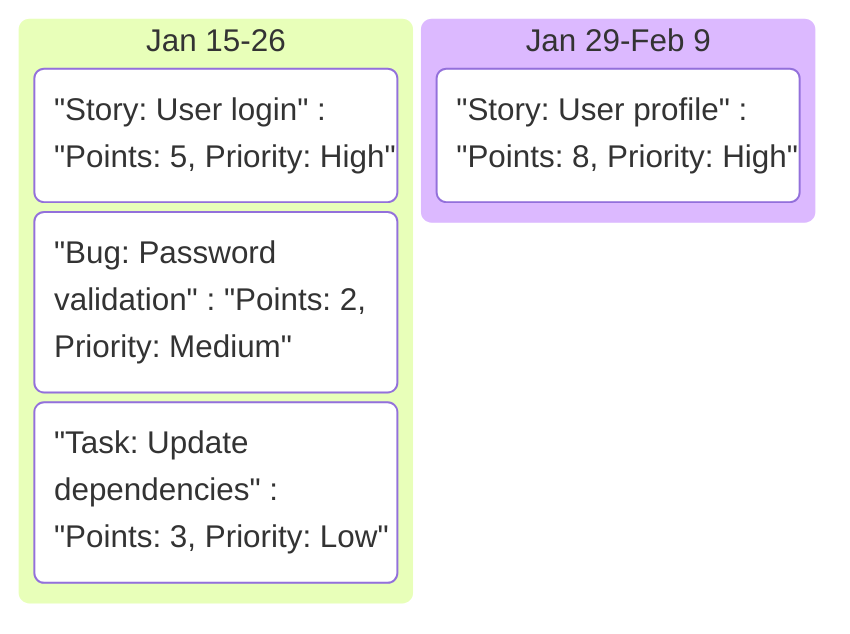
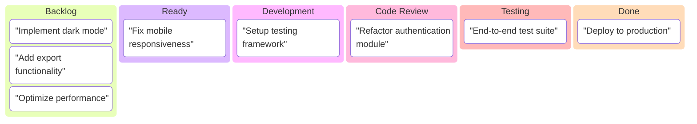
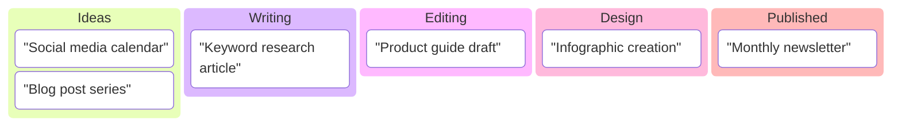
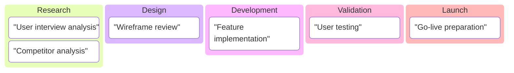

# Kanban Board Guidelines

## Overview
Kanban boards are essential for agile project management, visualizing workflow stages and task progress. The toolkit converts Mermaid Kanban syntax into professional Draw.io boards.

## Basic Syntax


## Advanced Features

### Task Details


### Multiple Assignees


## Best Practices

### Column Organization
- **Standard columns**: Backlog, Todo, In Progress, Review, Done
- **Custom columns**: Ready, Blocked, Testing, Deployed
- **Limit to 5-7 columns** for readability
- **Use consistent naming** across boards

### Task Management
- **Clear task titles** (under 50 characters)
- **Include status information** in descriptions
- **Use priority indicators** (High, Medium, Low)
- **Add assignee information** when relevant

### Workflow Optimization
- **WIP Limits**: Limit tasks in progress columns
- **Pull system**: Move tasks from right to left
- **Regular reviews**: Update board daily
- **Block identification**: Mark stuck tasks clearly

## Conversion Command
```bash
node kanban-converter.js -i mykanban.mmd -o mykanban.drawio
```

## Advanced Kanban Features

### Epic Tracking


### Sprint Planning


## Integration Tips

### With Other Diagrams
- **Link to flowcharts** for detailed task processes
- **Connect to Gantt charts** for timeline planning
- **Use mindmaps** for epic/feature breakdown
- **Combine with timelines** for release planning

### Team Collaboration
- **Real-time updates** in Draw.io
- **Comment on tasks** for clarification
- **Share with stakeholders** for transparency
- **Export for reports** and presentations

## Customization in Draw.io

### Styling Options
- Apply corporate color schemes
- Add team member avatars
- Include progress indicators
- Customize column widths

### Advanced Features
- Add due dates and reminders
- Include attachments and links
- Create board templates
- Set up automated notifications

## Common Patterns

### Software Development


### Content Marketing


### Product Management


## Metrics and Reporting

### Board Analytics
- **Cycle time**: Time from start to completion
- **Throughput**: Tasks completed per period
- **Work in progress**: Current active tasks
- **Bottleneck identification**: Slowest columns

### Performance Tracking
- **Velocity charts**: Track team capacity
- **Cumulative flow**: Visualize workflow stability
- **Distribution charts**: Task status overview

## Troubleshooting

### Common Issues
- **Too many columns**: Limit to essential workflow stages
- **Unclear task status**: Use consistent status terminology
- **Missing priorities**: Include priority levels for all tasks
- **No WIP limits**: Define capacity constraints

### Best Practices Checklist
- [ ] Clear workflow definition
- [ ] Consistent task naming
- [ ] Regular board updates
- [ ] Stakeholder communication
- [ ] Performance metrics tracking

## Examples
See `sample_kanban.mmd` for a complete working example of a software development board.</content>
<parameter name="filePath">/Users/disandup/Desktop/Final Converter Improved /Untitled/Guidelines/Kanban-Guidelines.md
