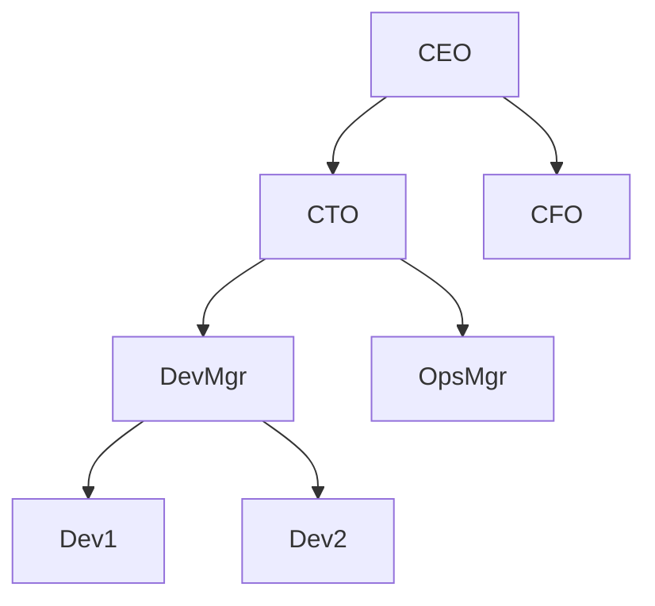
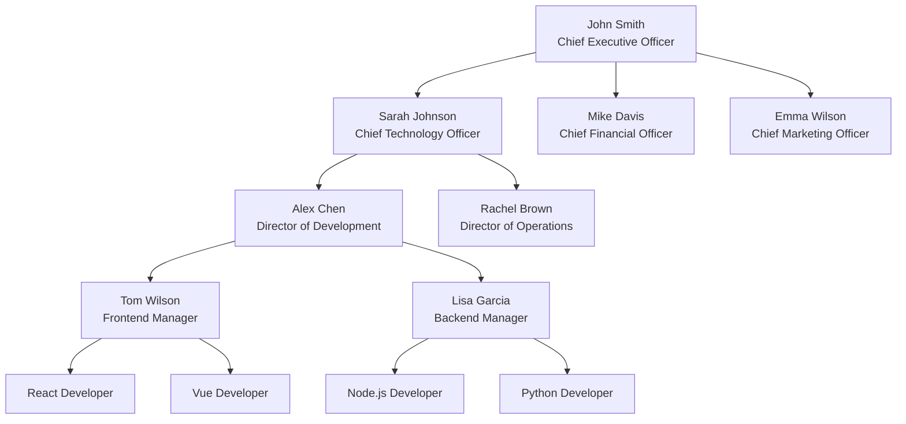
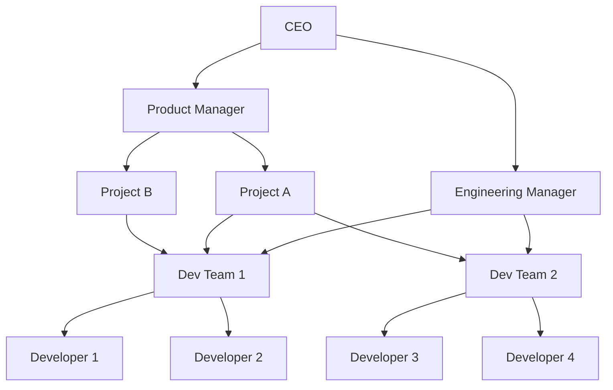
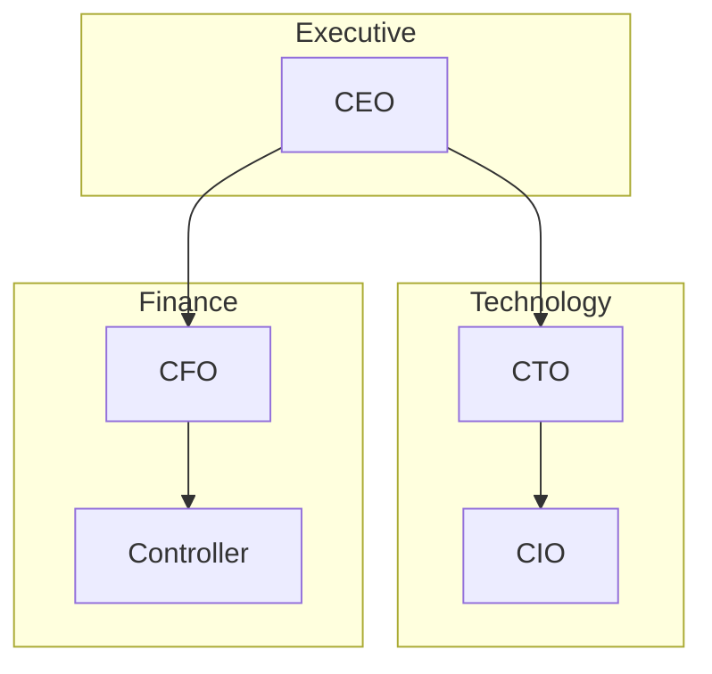
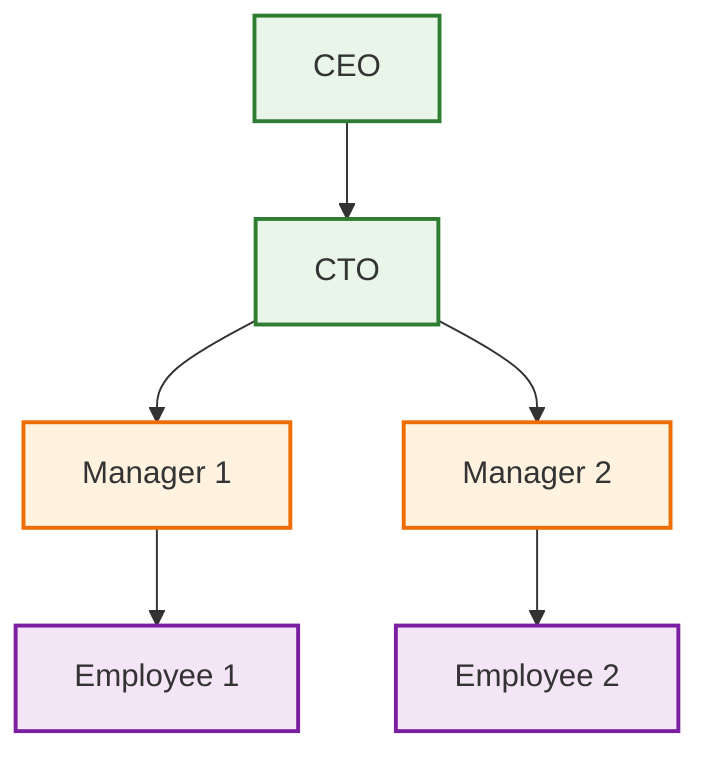
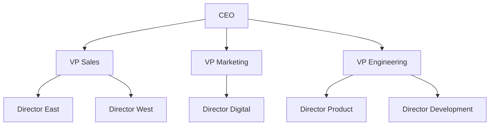
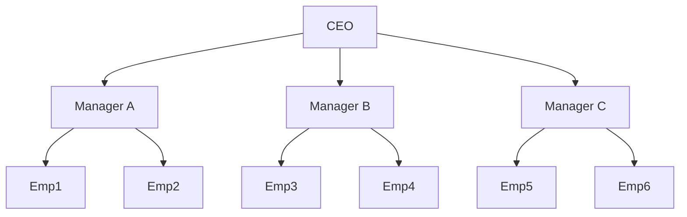
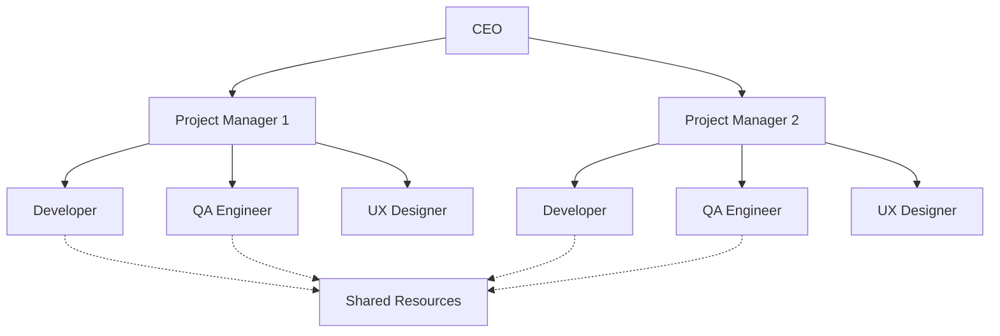

# Organizational Chart Guidelines

## Overview
Organizational charts visualize company hierarchies, reporting structures, and team relationships. The toolkit converts Mermaid graph syntax into professional Draw.io org charts.

## Basic Syntax


## Advanced Structure

### Multi-level Hierarchy


### Matrix Organization


## Best Practices

### Node Formatting
- **Include titles**: `Name[Full Name<br/>Job Title]`
- **Use consistent formatting**: Same style for same levels
- **Keep names concise**: Avoid overly long titles
- **Add departments**: Group by functional areas

### Hierarchy Design
- **Limit depth**: 4-5 levels maximum for readability
- **Balance branches**: Avoid heavily skewed structures
- **Use clear connections**: Solid lines for direct reports
- **Group logically**: Department or functional groupings

### Visual Consistency
- **Color coding**: Different colors for departments
- **Shape consistency**: Same shapes for same roles
- **Font hierarchy**: Larger fonts for higher positions
- **Spacing**: Adequate space between nodes

## Conversion Command
```bash
node orgchart-converter.js -i myorgchart.mmd -o myorgchart.drawio
```

## Advanced Features

### Department Grouping


### Role-based Styling


## Common Org Chart Types

### Traditional Hierarchy


### Flat Organization


### Project-based Structure


## Integration with Other Diagrams

### Combined Views
- **Link to process flows** showing how departments interact
- **Connect to RACI charts** for responsibility matrices
- **Use with timelines** for organizational changes
- **Combine with SWOT** for structural analysis

### Reporting Relationships
- **Solid lines**: Direct reports
- **Dashed lines**: Dotted line relationships
- **Colored lines**: Different types of relationships
- **Labels**: Relationship descriptions

## Draw.io Enhancement

### Layout Options
- **Hierarchical layout**: Traditional top-down
- **Compact layout**: Space-efficient arrangement
- **Custom positioning**: Manual arrangement for clarity

### Visual Enhancements
- **Icons**: Add role-specific icons
- **Photos**: Include employee photos
- **Contact info**: Add email/phone in tooltips
- **Links**: Connect to detailed profiles

## Data Management

### Large Organizations
- **Break into divisions**: Separate charts for departments
- **Use summaries**: High-level overview charts
- **Create indexes**: Reference system for large structures
- **Version control**: Track organizational changes

### Updates and Maintenance
- **Regular reviews**: Quarterly structure updates
- **Change tracking**: Document reorganization
- **Approval workflows**: Governance for changes
- **Communication plans**: Stakeholder notifications

## Accessibility Considerations

### Design for All Users
- **High contrast**: Ensure text readability
- **Alt text**: Describe chart purpose and structure
- **Screen reader friendly**: Logical reading order
- **Color blind friendly**: Use patterns with colors

### Inclusive Representation
- **Diverse representation**: Reflect organizational diversity
- **Clear hierarchies**: Avoid confusing structures
- **Consistent terminology**: Use standard job titles
- **Cultural sensitivity**: Respect naming conventions

## Troubleshooting

### Layout Issues
- **Overlapping nodes**: Increase spacing in Draw.io
- **Long labels**: Use abbreviations or line breaks
- **Unbalanced trees**: Adjust node positioning manually
- **Connection routing**: Use orthogonal connectors

### Conversion Problems
- **Complex structures**: Simplify for better conversion
- **Special characters**: Use plain text for names
- **Long hierarchies**: Break into multiple charts
- **Styling conflicts**: Apply styling after conversion

## Examples
See `sample_orgchart.mmd` for a complete company hierarchy example.</content>
<parameter name="filePath">/Users/disandup/Desktop/Final Converter Improved /Untitled/Guidelines/Org-Chart-Guidelines.md
