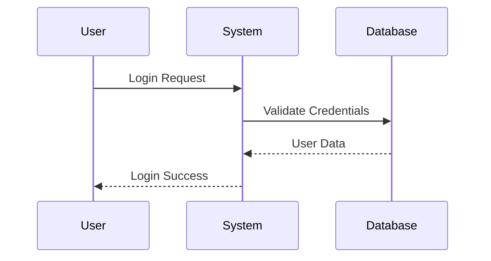
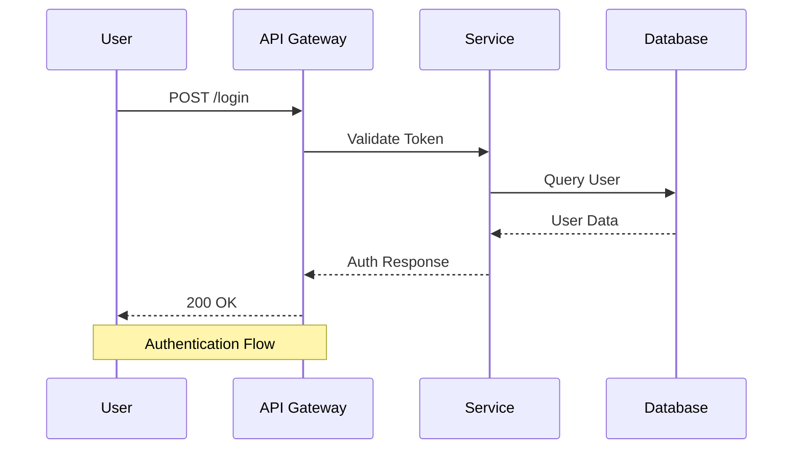
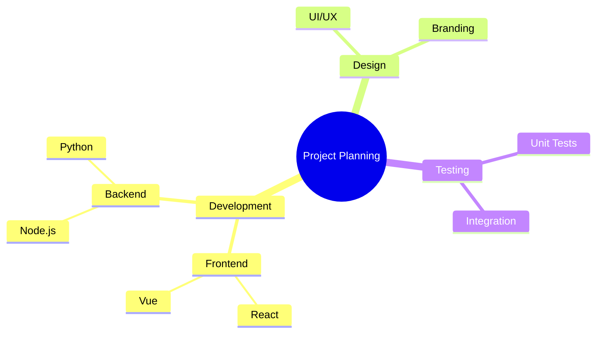
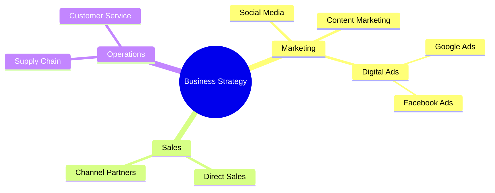
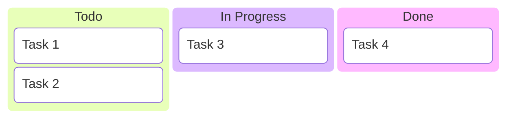
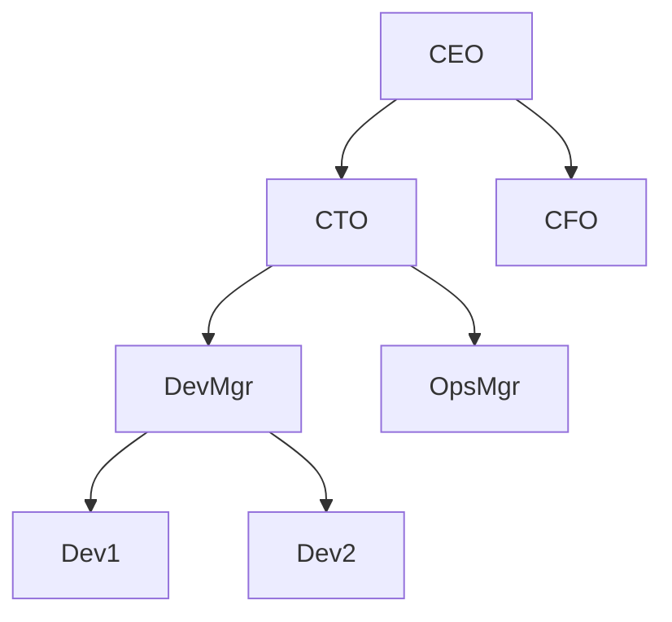
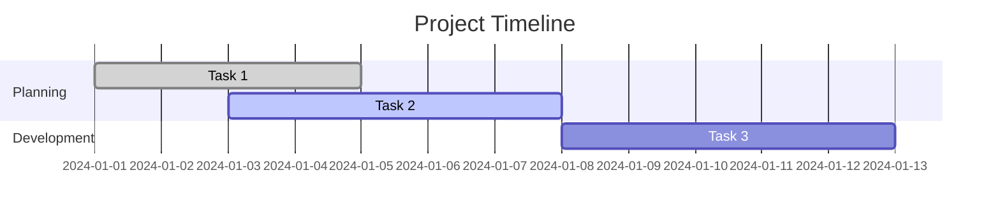
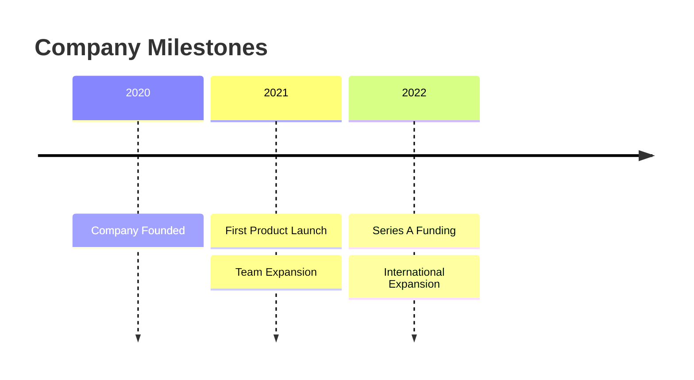

# Sequence and Mindmap Guidelines

## Sequence Diagram Guidelines

### Overview
Sequence diagrams visualize interactions between actors and systems over time, perfect for documenting API flows, user journeys, and system communications.

### Basic Syntax


### Participants
- `participant` - Define actors/systems
- Order determines horizontal position
- Use descriptive names (User, API, Database)

### Message Types
- `->>` - Solid arrow (synchronous)
- `-->>` - Dotted arrow (response)
- `-x` - Lost message
- `->>` - Open arrow
- `Note over A,B: Text` - Notes spanning participants

### Advanced Features


### Best Practices
- Limit to 6-8 participants for readability
- Use consistent naming conventions
- Group related interactions
- Add notes for complex logic
- Show error paths and edge cases

### Conversion Command
```bash
node sequence-converter.js -i mysequence.mmd -o mysequence.drawio
```

## Mindmap Guidelines

### Overview
Mindmaps help organize information hierarchically, ideal for brainstorming, knowledge management, and project planning.

### Basic Syntax


### Structure Rules
- Start with `root` node
- Use indentation for hierarchy
- Support unlimited nesting levels
- Icons and shapes available

### Advanced Features


### Best Practices
- Keep root concept clear and central
- Use 3-7 main branches from root
- Balance detail across branches
- Use keywords, not full sentences
- Color-code related concepts
- Limit to 3-4 hierarchy levels

### Conversion Command
```bash
node mindmap-converter.js -i mymindmap.mmd -o mymindmap.drawio
```

## Specialized Diagram Guidelines

### Kanban Boards


**Best for**: Task management, agile workflows
**Converter**: `kanban-converter.js`

### Organizational Charts


**Best for**: Company hierarchies, reporting structures
**Converter**: `orgchart-converter.js`

### Gantt Charts


**Best for**: Project schedules, timelines
**Converter**: `gantt-converter.js`

### Timelines


**Best for**: Historical events, roadmaps
**Converter**: `timeline-converter.js`

### SWOT Analysis
```
Strengths:
- Strong brand recognition
- Experienced team
- Innovative products

Weaknesses:
- Limited market presence
- High operational costs
- Dependency on key suppliers

Opportunities:
- Growing market demand
- New technology trends
- Strategic partnerships

Threats:
- Increasing competition
- Economic uncertainty
- Regulatory changes
```

**Best for**: Strategic planning, business analysis
**Converter**: `swot-converter.js`
**Input format**: Plain text (.txt)

## Conversion Workflow

### 1. Design Phase
- Sketch diagram structure first
- Choose appropriate diagram type
- Validate Mermaid syntax
- Consider audience and purpose

### 2. Creation Phase
- Use Mermaid Live Editor for testing
- Apply consistent styling
- Add necessary metadata (titles, labels)
- Include documentation comments

### 3. Conversion Phase
- Select appropriate converter
- Run conversion command
- Verify output file creation
- Check for conversion warnings

### 4. Refinement Phase
- Open in Draw.io for final adjustments
- Apply corporate branding
- Adjust layout for presentation
- Export to required formats

## Quality Assurance

### Pre-Conversion Checks
- [ ] Syntax validation in Mermaid editor
- [ ] Consistent naming conventions
- [ ] Appropriate diagram type selection
- [ ] Data accuracy (for charts)
- [ ] Readability considerations

### Post-Conversion Checks
- [ ] Layout renders correctly
- [ ] All elements visible
- [ ] Colors and styling preserved
- [ ] Text is readable
- [ ] Connections are clear

## Integration Patterns

### Documentation Sets
- Combine flowcharts with sequence diagrams
- Use mindmaps for project overviews
- Include charts for metrics and KPIs
- Create diagram libraries for reuse

### Presentation Integration
- Export consistent formats (PNG/PDF)
- Use Draw.io themes for branding
- Create master slides with diagrams
- Maintain version control for diagrams

## Troubleshooting Guide

### Common Issues
- **Syntax errors**: Validate in Mermaid Live Editor first
- **Layout problems**: Check diagram complexity and size
- **Missing elements**: Verify all connections are defined
- **Styling issues**: Some advanced features may not convert perfectly

### Performance Optimization
- Break large diagrams into smaller ones
- Use batch processing for multiple conversions
- Optimize image sizes for web use
- Cache frequently used diagram components</content>
<parameter name="filePath">/Users/disandup/Desktop/Final Converter Improved /Untitled/Guidelines/Sequence-and-Mindmap-Guidelines.md
