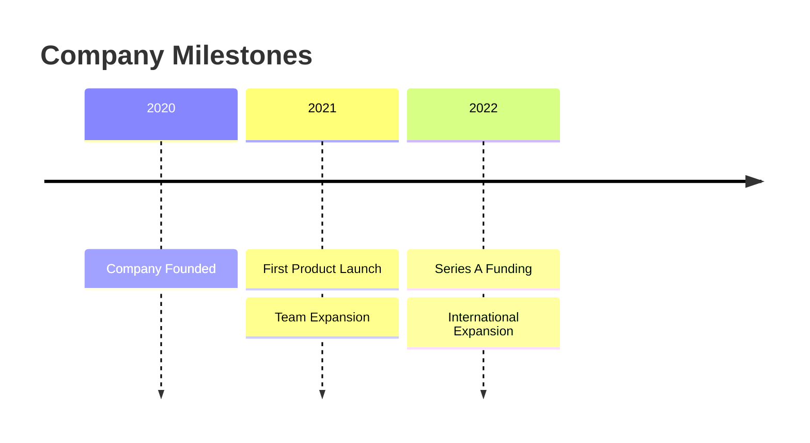
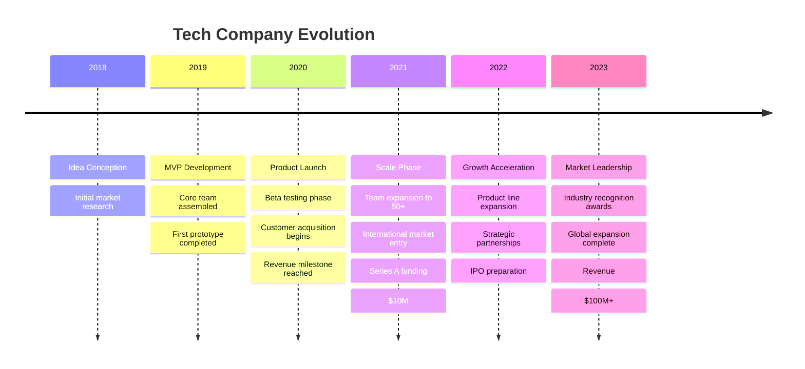
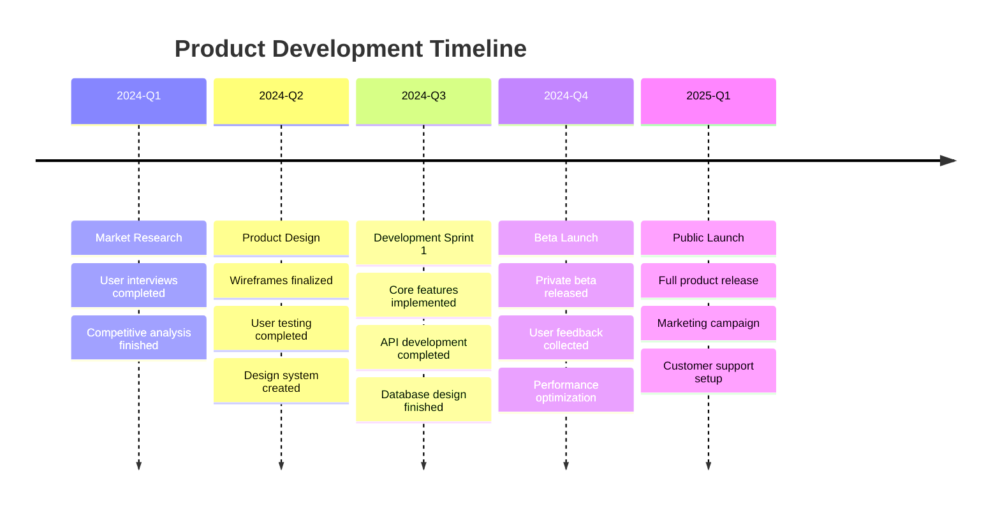
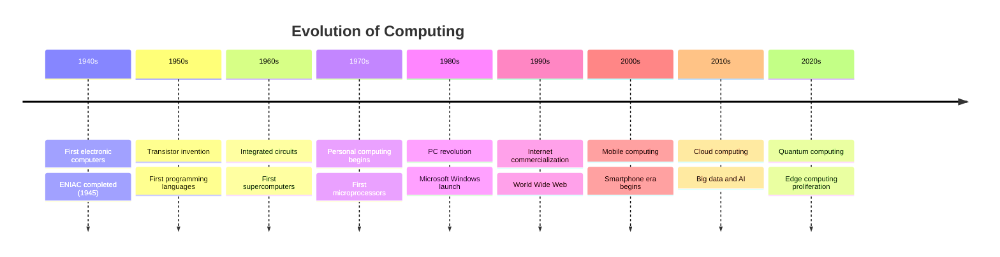
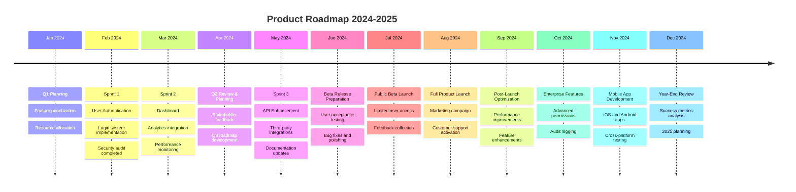
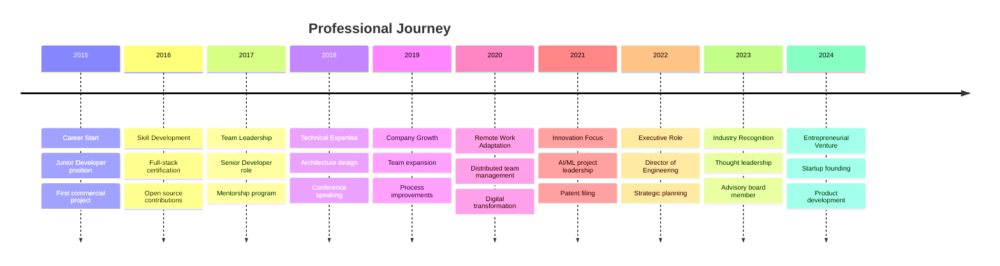
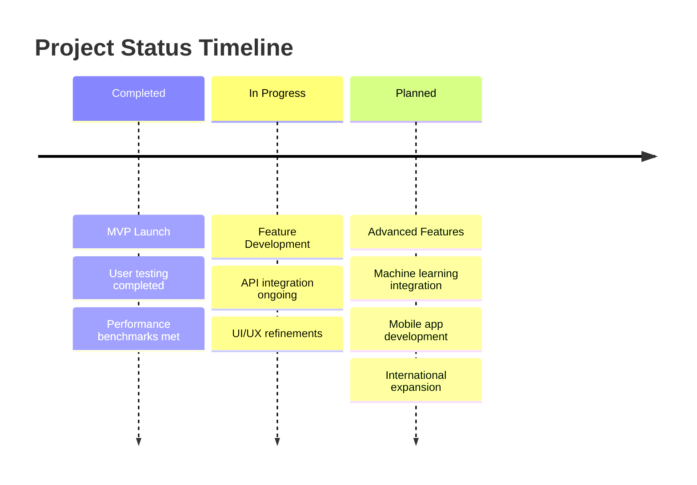
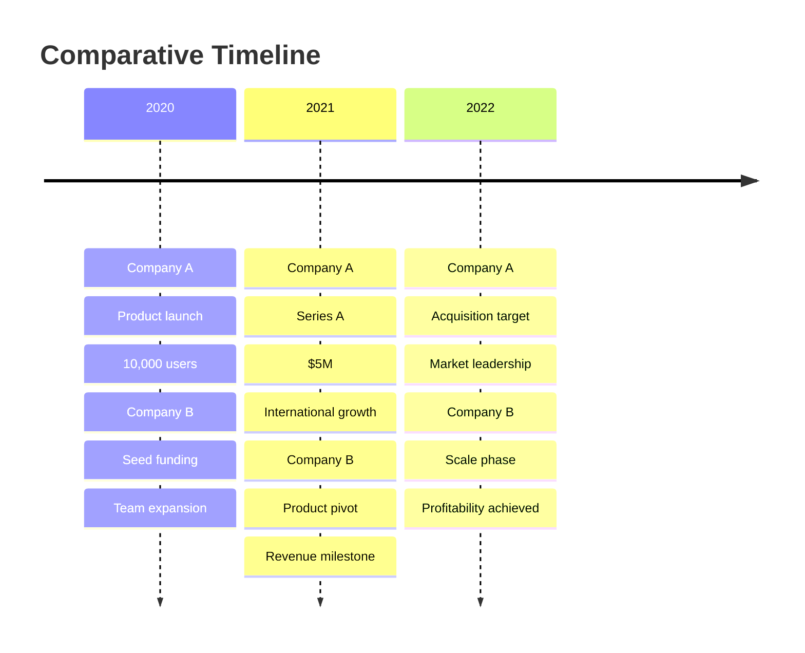
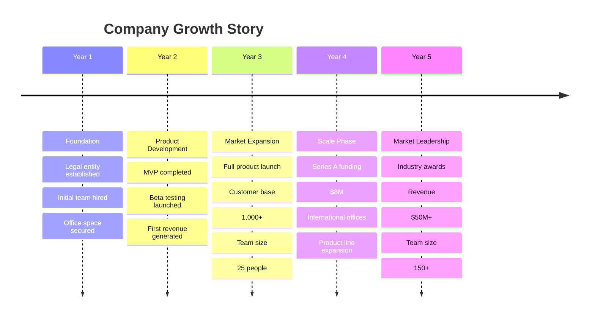
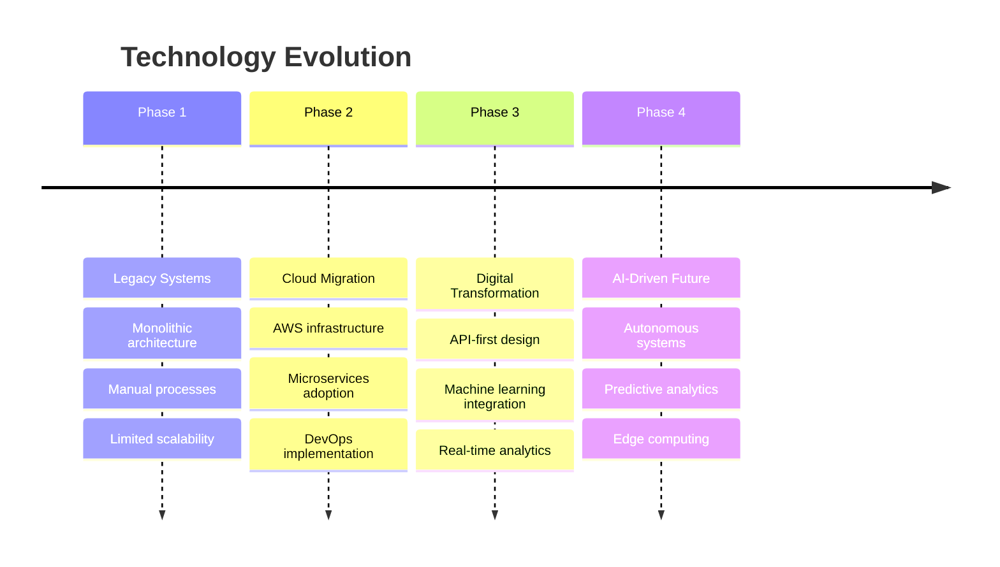

# Timeline Guidelines

## Overview
Timelines visualize chronological events, historical sequences, and future roadmaps. The toolkit converts Mermaid timeline syntax into professional Draw.io chronological diagrams.

## Basic Syntax


## Advanced Features

### Detailed Timeline


### Multi-track Timeline


## Best Practices

### Content Organization
- **Chronological order**: Events must flow forward in time
- **Consistent granularity**: Same time periods (years, quarters, months)
- **Clear milestones**: Major achievements and turning points
- **Balanced detail**: Not too sparse or overwhelming

### Visual Design
- **Time markers**: Clear date/year indicators
- **Event grouping**: Related events under same time period
- **Status indicators**: Past, present, future differentiation
- **Progress visualization**: Show completion status

### Information Hierarchy
- **Primary events**: Major milestones and achievements
- **Secondary details**: Supporting information and context
- **Key metrics**: Quantifiable results and impacts
- **Future projections**: Planned events and goals

## Conversion Command
```bash
node timeline-converter.js -i mytimeline.mmd -o mytimeline.drawio
```

## Timeline Types

### Historical Timeline


### Project Roadmap


### Personal Career Timeline


## Advanced Features

### Status Indicators


### Multi-column Timeline


## Integration with Other Diagrams

### Combined Views
- **Link to Gantt charts** for detailed project planning
- **Connect to flowcharts** for process evolution
- **Use with org charts** for team growth visualization
- **Combine with bar charts** for metric tracking over time

### Cross-referencing
- **Milestone connections**: Link timeline events to other diagrams
- **Data integration**: Pull metrics from charts into timeline
- **Status synchronization**: Keep timeline updated with project status
- **Version control**: Track timeline changes over time

## Draw.io Enhancement

### Layout Options
- **Horizontal timeline**: Traditional left-to-right flow
- **Vertical timeline**: Top-to-bottom for space efficiency
- **Curved timeline**: For visual appeal in presentations
- **Interactive timeline**: Clickable events with details

### Visual Enhancements
- **Icons and images**: Add visual elements for each era
- **Color coding**: Different colors for different phases
- **Progress bars**: Show completion status
- **Animations**: For presentation effects

## Content Strategy

### Audience Consideration
- **Executive level**: High-level milestones and metrics
- **Team level**: Detailed tasks and deliverables
- **Customer facing**: Product releases and improvements
- **Investor focused**: Growth metrics and achievements

### Content Types
- **Achievements**: Completed milestones and successes
- **Metrics**: Quantitative results and KPIs
- **Challenges**: Overcome obstacles and learnings
- **Future plans**: Upcoming initiatives and goals

## Common Use Cases

### Business Milestones


### Technology Adoption


## Troubleshooting

### Content Issues
- **Chronological errors**: Ensure proper time sequencing
- **Missing context**: Add background information for events
- **Inconsistent formatting**: Standardize date and description formats
- **Information overload**: Prioritize key events and details

### Conversion Problems
- **Complex layouts**: Simplify for better Draw.io rendering
- **Long descriptions**: Break into bullet points
- **Special characters**: Use plain text formatting
- **Date parsing**: Ensure consistent date formats

## Examples
See `sample_timeline.mmd` for a complete company milestones example.</content>
<parameter name="filePath">/Users/disandup/Desktop/Final Converter Improved /Untitled/Guidelines/Timeline-Guidelines.md
