# Mermaid to Draw.io Converter Toolkit

A comprehensive CLI toolkit that converts various Mermaid diagram types to Draw.io XML format with professional styling and pixel-perfect accuracy.

## 🚀 Quick Start

1. **Install Dependencies:**
   ```bash
   npm install -g @mermaid-js/mermaid-cli
   npm install
   ```

2. **Convert Your First Diagram:**
   ```bash
   # Try the sample flowchart
   node converter.js -i sample_flowchart.mmd -o my_first_flowchart.drawio

   # Or try other samples
   node kanban-converter.js -i sample_kanban.mmd -o my_kanban.drawio
   node piechart-converter.js -i sample_piechart.mmd -o my_piechart.drawio
   node userjourney-converter.js Templates/userjourney-template.mmd userjourney.drawio
   node barchart-converter.js -i sample_barchart.mmd -o my_barchart.drawio
   node linechart-converter.js sample_linechart.mmd my_linechart.drawio
   node sequence-converter.js -i sample_sequence.mmd -o my_sequence.drawio
   node mindmap-converter.js -i sample_mindmap.mmd -o my_mindmap.drawio
   node swot-converter.js -i swot-input.txt -o my_swot.drawio
   ```

3. **Open in Draw.io:**
   - The `.drawio` file opens directly in Draw.io
   - Professional styling ready for presentations

## � Documentation & Resources

### User Guides
- **[Guidelines/](Guidelines/)** - Comprehensive guides for all diagram types
- **[Templates/](Templates/)** - Ready-to-use templates for quick start
- **[CHEAT-SHEET.md](CHEAT-SHEET.md)** - Quick reference for commands and syntax
- **[Workflow-Guide.md](Guidelines/Workflow-Guide.md)** - Complete diagram creation workflow

### Support
- **[FAQ.md](Guidelines/FAQ.md)** - Frequently asked questions and answers
- **[Troubleshooting-Guide.md](Guidelines/Troubleshooting-Guide.md)** - Solutions for common issues
- **[CONTRIBUTING.md](CONTRIBUTING.md)** - How to contribute to the project

### Examples
- **Sample Files**: `sample_*.mmd` files for each diagram type
- **Workflow Demo**: `toolkit-workflow.mmd` → `toolkit-workflow.drawio`
- **Template Library**: Pre-built templates in `Templates/` folder

## �📊 Supported Diagram Types

| Type | Syntax | Converter | Use Case |
|------|--------|-----------|----------|
| **Flowcharts** | `graph TD/LR/RL` | `converter.js` | Process flows, decision trees |
| **Kanban Boards** | `kanban` | `kanban-converter.js` | Task management, agile boards |
| **Pie Charts** | `pie` | `piechart-converter.js` | Data visualization, proportions |
| **Org Charts** | `graph TD` | `orgchart-converter.js` | Company hierarchy, reporting |
| **Gantt Charts** | `gantt` | `gantt-converter.js` | Project timelines, schedules |
| **Timelines** | `timeline` | `timeline-converter.js` | Historical events, roadmaps |
| **Bar Charts** | `xychart-beta` | `barchart-converter.js` | Comparisons, metrics |
| **Line Charts** | `xychart-beta` | `linechart-converter.js` | Trends, time series data |
| **Sequence Diagrams** | `sequenceDiagram` | `sequence-converter.js` | Interaction flows, system communications |
| **Mindmaps** | `mindmap` | `mindmap-converter.js` | Brainstorming, knowledge organization |
| **SWOT Analysis** | `quadrant-1/2/3/4` | `swot-converter.js` | Business analysis, strategic planning |
| **User Journey Maps** | `journey` | `userjourney-converter.js` | User experience mapping, customer journeys |

## 📁 Project Structure

```
├── converter.js              # Flowchart converter (SVG Relay Method)
├── kanban-converter.js       # Kanban board converter
├── piechart-converter.js     # Pie chart converter
├── orgchart-converter.js     # Organizational chart converter
├── gantt-converter.js        # Gantt chart converter
├── timeline-converter.js     # Timeline converter
├── barchart-converter.js     # Bar chart converter
├── linechart-converter.js    # Line chart converter
├── sequence-converter.js     # Sequence diagram converter
├── mindmap-converter.js      # Mindmap converter
├── swot-converter.js         # SWOT analysis converter
├── userjourney-converter.js  # User journey map converter
├── sample_*.mmd             # Ready-to-use sample diagrams
├── package.json             # Dependencies
└── README.md               # This documentation
```

## 🧪 Try the Samples

The toolkit includes ready-to-use sample files for each diagram type:

| Sample File | Description | Command |
|-------------|-------------|---------|
| `sample_flowchart.mmd` | User login flowchart | `node converter.js -i sample_flowchart.mmd -o flowchart.drawio` |
| `sample_kanban.mmd` | Software development board | `node kanban-converter.js sample_kanban.mmd kanban.drawio` |
| `sample_piechart.mmd` | Browser usage statistics | `node piechart-converter.js -i sample_piechart.mmd -o piechart.drawio` |
| `sample_orgchart.mmd` | Company hierarchy | `node orgchart-converter.js -i sample_orgchart.mmd -o orgchart.drawio` |
| `sample_gantt.mmd` | Website redesign project | `node gantt-converter.js -i sample_gantt.mmd -o gantt.drawio` |
| `sample_timeline.mmd` | Tech company milestones | `node timeline-converter.js -i sample_timeline.mmd -o timeline.drawio` |
| `sample_barchart.mmd` | Monthly website traffic | `node barchart-converter.js -i sample_barchart.mmd -o barchart.drawio` |
| `sample_linechart.mmd` | Quarterly sales trends | `node linechart-converter.js sample_linechart.mmd linechart.drawio` |
| `sample_temperature_linechart.mmd` | Monthly temperature data | `node linechart-converter.js sample_temperature_linechart.mmd temperature.drawio` |
| `sample_stock_linechart.mmd` | Stock price performance | `node linechart-converter.js sample_stock_linechart.mmd stock.drawio` |
| `sample_sequence.mmd` | User authentication flow | `node sequence-converter.js sample_sequence.mmd sequence.drawio` |
| `sample_mindmap.mmd` | Project planning mindmap | `node mindmap-converter.js sample_mindmap.mmd mindmap.drawio` |
| `swot-input.txt` | Business SWOT analysis | `node swot-converter.js -i swot-input.txt -o swot.drawio` |
| `Templates/userjourney-template.mmd` | Customer purchase journey | `node userjourney-converter.js Templates/userjourney-template.mmd userjourney.drawio` |

**Quick test all converters:**
```bash
# Test all samples at once
for file in sample_*.mmd; do
  converter="${file%_*}-converter.js"
  output="${file%.mmd}.drawio"
  node "$converter" -i "$file" -o "$output" && echo "✅ $file converted"
done
```

## 🛠️ Installation & Setup

### Prerequisites
- **Node.js** (v14 or higher)
- **npm** (comes with Node.js)

### Installation Steps
1. **Install Mermaid CLI globally:**
   ```bash
   npm install -g @mermaid-js/mermaid-cli
   ```

2. **Clone or download this repository:**
   ```bash
   git clone https://github.com/DisanduP/Perfected-Flowchart-Tool.git
   cd Perfected-Flowchart-Tool
   ```

3. **Install dependencies:**
   ```bash
   npm install
   ```

4. **Verify installation:**
   ```bash
   node converter.js --help
   ```

## 💡 Usage Guide

### Basic Command Structure
```bash
node [converter-file].js -i input.mmd -o output.drawio
```

### Command Line Options
- `-i, --input <file>`: Input Mermaid file (.mmd) - **required**
- `-o, --output <file>`: Output Draw.io file (.drawio) - optional (has defaults)
- `-v, --version`: Show version number
- `-h, --help`: Show help for specific converter

**Note:** Converters use different argument styles:
- **Commander.js style** (flowchart, piechart, orgchart, gantt, timeline, barchart): `node converter.js -i input.mmd -o output.drawio`
- **Positional style** (kanban): `node kanban-converter.js input.mmd output.drawio`

### Example Commands
```bash
# Flowchart (Commander.js style)
node converter.js -i flowchart.mmd -o flowchart.drawio

# Kanban Board (Positional style)
node kanban-converter.js kanban.mmd kanban.drawio

# Pie Chart
node piechart-converter.js -i piechart.mmd -o piechart.drawio

# Org Chart
node orgchart-converter.js -i orgchart.mmd -o orgchart.drawio

# Gantt Chart
node gantt-converter.js -i gantt.mmd -o gantt.drawio

# Timeline
node timeline-converter.js -i timeline.mmd -o timeline.drawio

# Bar Chart
node barchart-converter.js -i barchart.mmd -o barchart.drawio

# Sequence Diagram
node sequence-converter.js sequence.mmd sequence.drawio

# Mindmap
node mindmap-converter.js mindmap.mmd mindmap.drawio

# SWOT Analysis
node swot-converter.js -i swot.txt -o swot.drawio
```

## 📝 Detailed Examples

### 1. Flowchart Example
**Input** (`flowchart.mmd`):
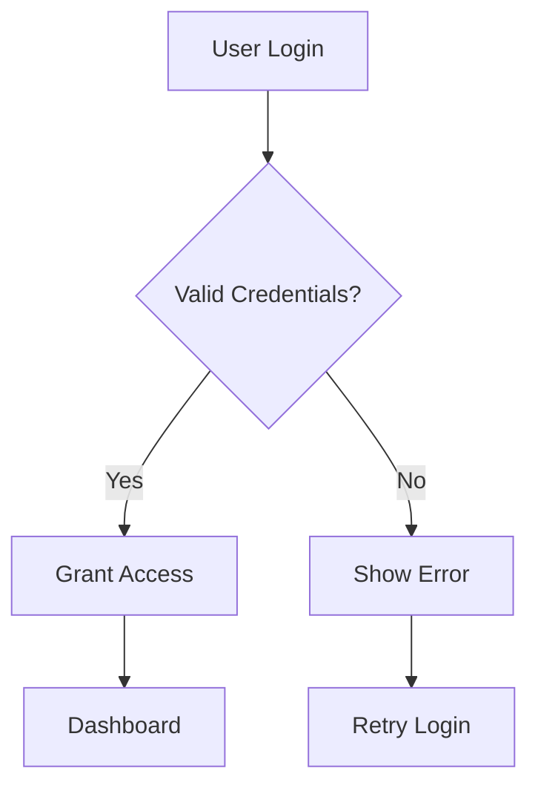

**Command:**
```bash
node converter.js -i flowchart.mmd -o flowchart.drawio
```

**Output:** Professional flowchart with auto-added Start/End nodes, perfect layout preservation.

### 2. Kanban Board Example
**Input** (`kanban.mmd`):
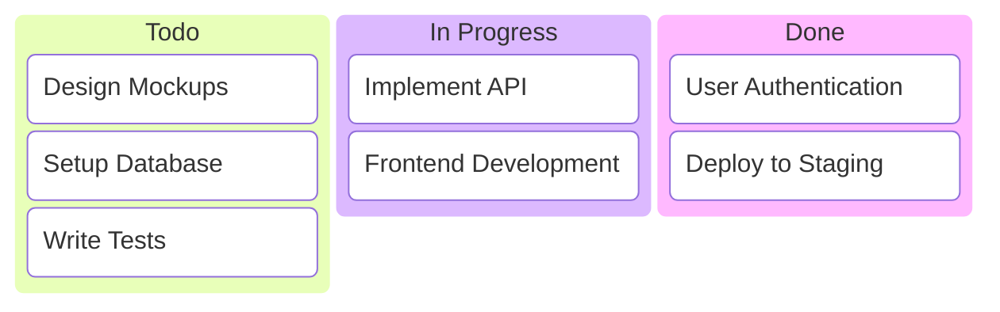

**Command:**
```bash
node kanban-converter.js -i kanban.mmd -o kanban.drawio
```

**Output:** Swimlane-based task board with professional styling.

### 3. Pie Chart Example
**Input** (`piechart.mmd`):
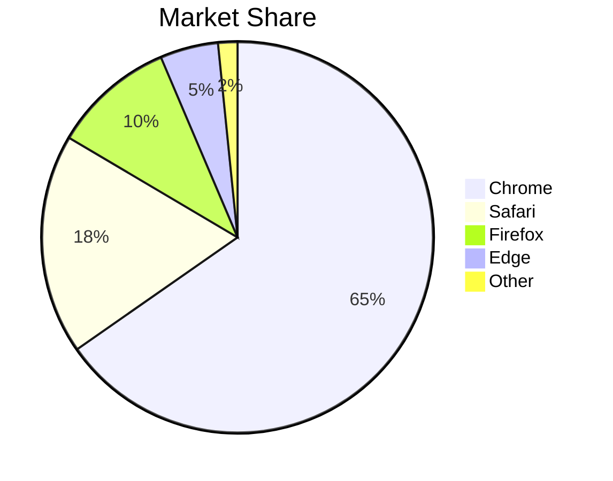

**Command:**
```bash
node piechart-converter.js -i piechart.mmd -o piechart.drawio
```

**Output:** Circular chart with mathematically positioned labels.

### 4. Organizational Chart Example
**Input** (`orgchart.mmd`):
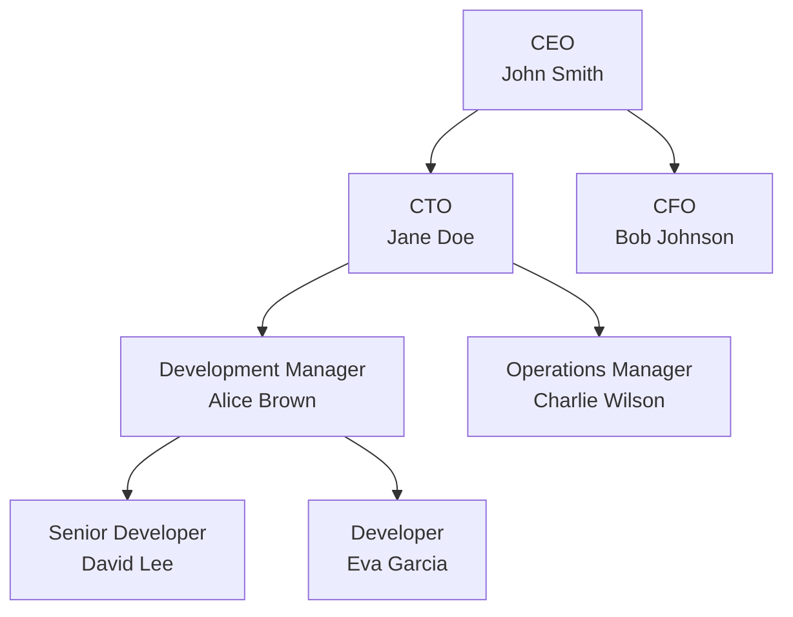

**Command:**
```bash
node orgchart-converter.js -i orgchart.mmd -o orgchart.drawio
```

**Output:** Hierarchical organization structure with clean layout.

### 5. Gantt Chart Example
**Input** (`gantt.mmd`):
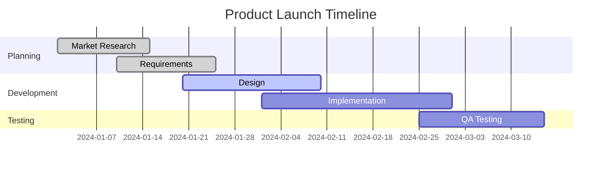

**Command:**
```bash
node gantt-converter.js -i gantt.mmd -o gantt.drawio
```

**Output:** Timeline-based project schedule with date calculations.

### 6. Timeline Example
**Input** (`timeline.mmd`):
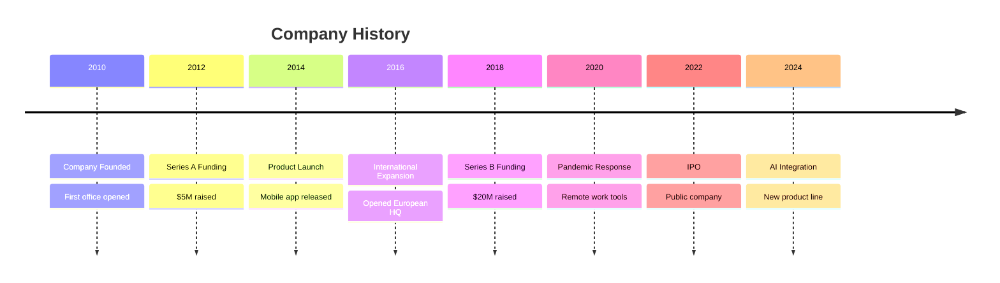

**Command:**
```bash
node timeline-converter.js -i timeline.mmd -o timeline.drawio
```

**Output:** Historical timeline with alternating event positioning.

### 7. Bar Chart Example
**Input** (`barchart.mmd`):
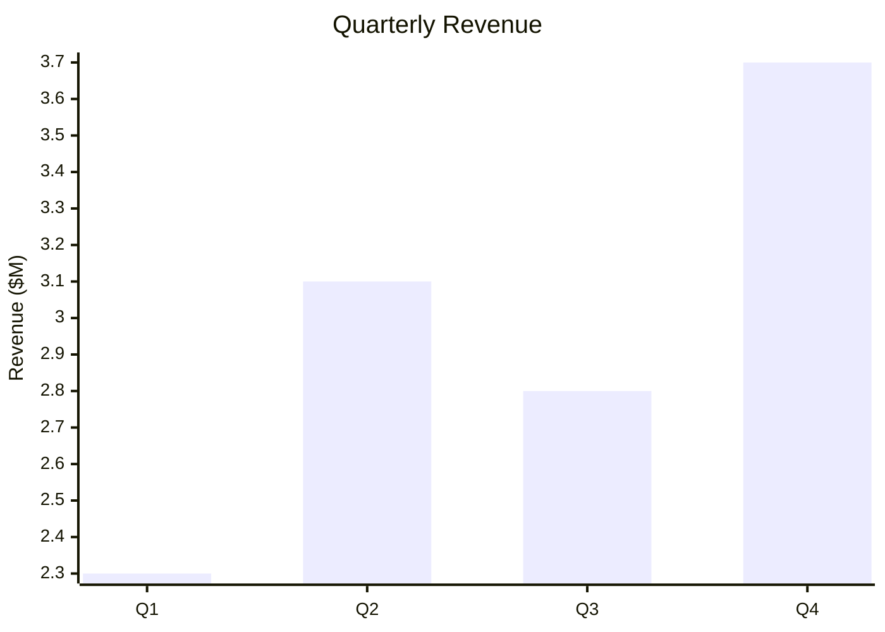

**Command:**
```bash
node barchart-converter.js -i barchart.mmd -o barchart.drawio
```

**Output:** Vertical bar chart with axes, value labels, and category labels.

### 8. Line Chart Example
**Input** (`linechart.mmd`):
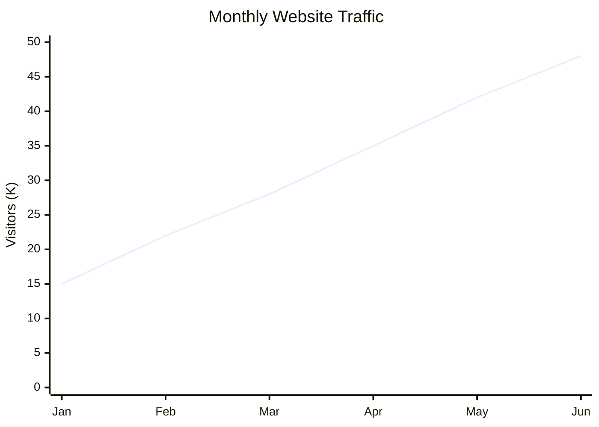

**Command:**
```bash
node linechart-converter.js linechart.mmd linechart.drawio
```

**Output:** Line chart with connecting data points, axes, grid lines, and value labels showing trends over time.

### 9. Sequence Diagram Example
**Input** (`sequence.mmd`):
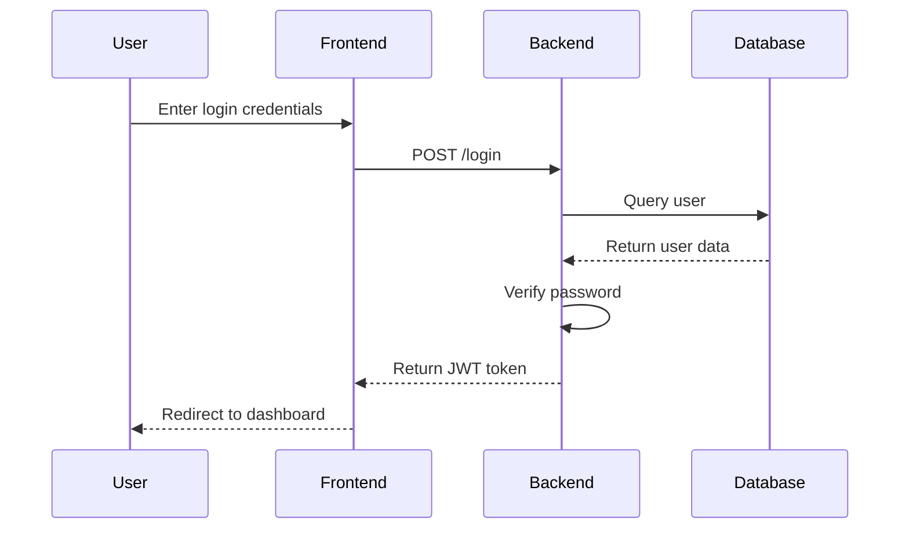

**Command:**
```bash
node sequence-converter.js sequence.mmd sequence.drawio
```

**Output:** Timeline-based interaction diagram with lifelines and message arrows.

### 10. Mindmap Example
**Input** (`mindmap.mmd`):
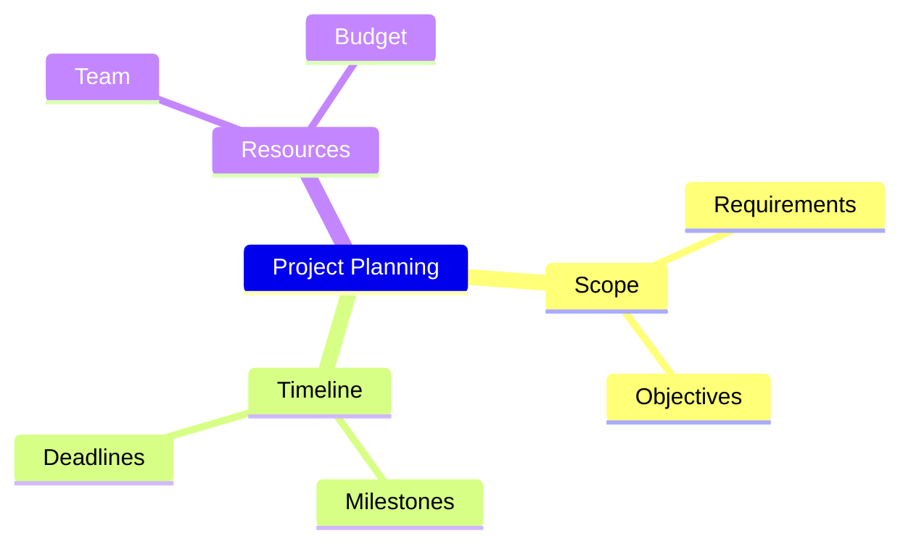

**Command:**
```bash
node mindmap-converter.js mindmap.mmd mindmap.drawio
```

**Output:** Radial mindmap with root node and expanding branches.

### 11. User Journey Example
**Input** (`Templates/userjourney-template.mmd`):
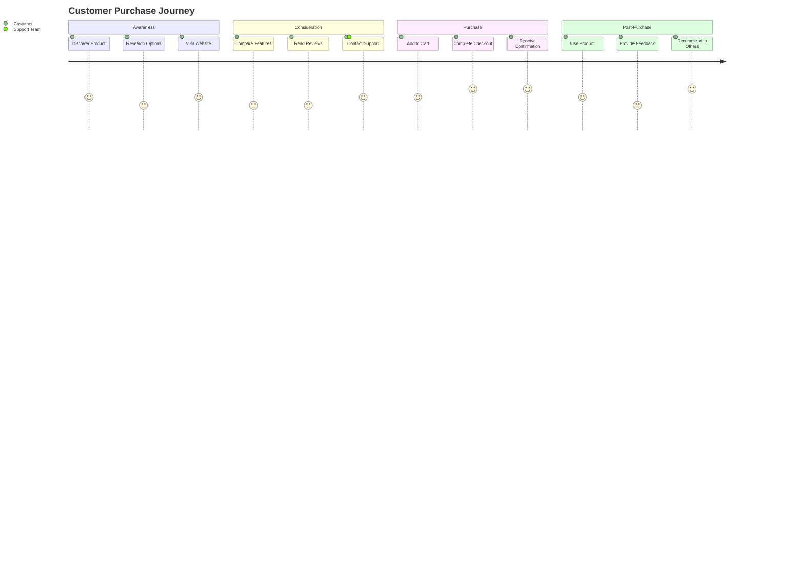

**Command:**
```bash
node userjourney-converter.js Templates/userjourney-template.mmd userjourney.drawio
```

**Output:** Swimlane diagram with actor lanes (Customer, Support Team) and connected task nodes showing the customer journey progression.


### 12. SWOT Analysis Example
**Input** (`swot-input.txt`):
```
quadrant-1 Strengths
- Strong brand reputation
- Experienced team
- Innovative products

quadrant-2 Weaknesses
- High operational costs
- Limited market presence
- Dependency on key suppliers

quadrant-3 Opportunities
- Growing market demand
- Emerging technologies
- Strategic partnerships

quadrant-4 Threats
- Intense competition
- Economic downturns
- Regulatory changes
```

**Command:**
```bash
node swot-converter.js -i swot-input.txt -o swot.drawio
```

**Output:** Professional 2x2 SWOT matrix with quadrant containers and stacked bullet points.

## 🎨 Features & Benefits

### Professional Styling
- **Enterprise-Ready**: Consistent theming across all diagram types
- **Clean Typography**: Normal font weight, proper sizing
- **Perfect Layout**: Pixel-perfect positioning and scaling
- **Smart Enhancements**: Auto-added elements for complete diagrams

### Technical Excellence
- **Precise Conversion**: Zero deviation from Mermaid layouts
- **Multiple Methods**: SVG Relay for flowcharts, direct parsing for others
- **Mathematical Accuracy**: Proper calculations for charts and timelines
- **Clean XML Output**: Draw.io compatible files ready for use

### Developer Experience
- **Simple CLI**: Consistent interface across all converters
- **Clear Documentation**: Comprehensive examples and guides
- **Error Handling**: Helpful error messages and validation
- **Extensible**: Easy to add new diagram types

## 🔧 Troubleshooting

### Common Issues

**"Command not found" error:**
```bash
# Make sure you're in the project directory
cd /path/to/Perfected-Flowchart-Tool

# Check if files exist
ls *.js
```

**"File not found" error:**
```bash
# Use absolute paths or ensure files are in current directory
node converter.js -i ./my-diagram.mmd -o ./output.drawio
```

**Mermaid CLI not found:**
```bash
# Install globally
npm install -g @mermaid-js/mermaid-cli

# Verify installation
mmdc --version
```

### Getting Help
```bash
# General help
node converter.js --help

# Specific converter help
node kanban-converter.js --help
```

## 📋 File Format Reference

### Input Files (.mmd)
- Standard Mermaid syntax
- UTF-8 encoded text files
- Comments supported with `%%`
- One diagram per file

### Output Files (.drawio)
- XML format compatible with Draw.io
- Opens directly in Draw.io desktop/web
- Professional styling applied
- Ready for editing and export

## 🤝 Contributing

1. **Report Issues**: Use GitHub issues for bugs or feature requests
2. **Suggest Diagrams**: Propose new Mermaid diagram types to support
3. **Improve Code**: Submit pull requests for enhancements
4. **Share Examples**: Contribute sample diagrams for testing

## 🆘 Getting Help & Community

### Documentation First
- **[Guidelines Folder](Guidelines/)** - Detailed guides for every diagram type
- **[FAQ](Guidelines/FAQ.md)** - Common questions and solutions
- **[Troubleshooting Guide](Guidelines/Troubleshooting-Guide.md)** - Step-by-step problem solving
- **[Cheat Sheet](CHEAT-SHEET.md)** - Quick command reference

### Quick Resources
- **Templates**: Copy from `Templates/` folder to get started fast
- **Samples**: Test with included `sample_*.mmd` files
- **Workflow Guide**: Follow the complete process in `Guidelines/Workflow-Guide.md`

### Contributing
- **[Contributing Guide](CONTRIBUTING.md)** - How to report issues or contribute code
- **Bug Reports**: Use clear titles and include sample files
- **Feature Requests**: Describe use cases and proposed solutions

### Validation & Testing
- Test syntax in [Mermaid Live Editor](https://mermaid.live)
- Validate converted files in Draw.io
- Check file sizes and performance for large diagrams

---

## 📄 License

This project is open source. Feel free to use, modify, and distribute.

---

**Ready to create professional diagrams?** Start with the Quick Start guide above and convert your first Mermaid diagram to Draw.io format! 🎯
